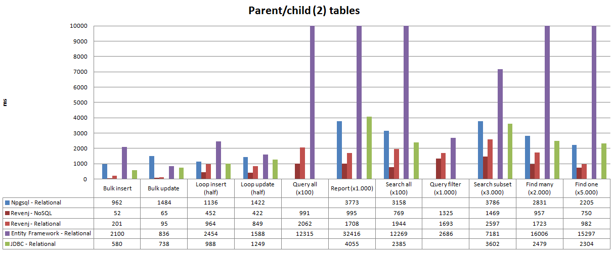
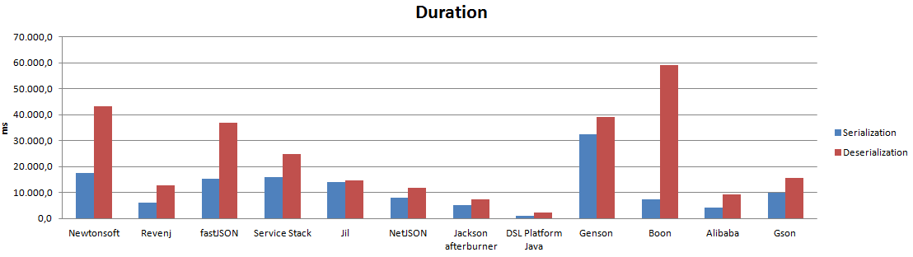
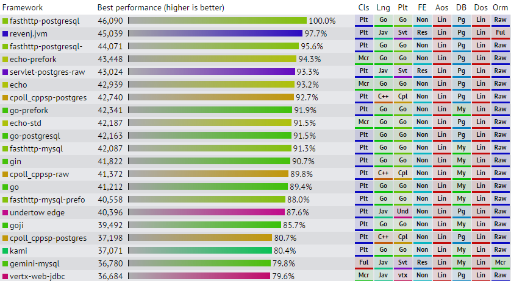

Revenj
======

Revenj is a *fast* framework for .NET/JVM with advanced LINQ support for Postgres and Oracle databases. 
It's ideal to use as a REST-like service, but can also be used as a library from other frameworks such as ASP.NET, Spring...

DSL Platform will use Invasive software composition to integrate with Revenj, so 
developers can focus on rich modeling (NoSQL/ER hybrid on top of ORDBMS).
DSL Platform will take care of various boilerplate and model evolution while Revenj will expose:

 * persistence
 * reporting
 * notifications
 * cache invalidation
 * event sourcing
 * security
 * serialization

and various other simple and complex features captured in the model.
With Revenj you will stop writing PO*O and instead focus on domain model/business value.

## How it works

Domain is described using various modeling building blocks in a DSL, for example:

    module REST {
      aggregate Document(title) {
        string title;
        timestamp createdOn;
        Set<string(10)> tags { index; }
        Document? *parent;
        List<Part> parts;
        Properties metadata;
        persistence { history; }
      }
      value Part {
        Type type;
        string content;
        Queue<string> footnotes;
      }
      enum Type {
        Documentation;
        Specification;
        Requirement;
      }
      snowflake<Document> DocumentList {
        title;
        createdOn;
        tags;
        order by createdOn desc;
      }
    }

Which gives you a DTO/POCO/POJO/POPO/POSO... across different languages, 
tables, types, views, functions specialized for supported ORDBMS, 
repositories, converters, serialization and various other boilerplate required by the supported frameworks.
There are also a lot more modeling concepts which go beyond basic persistence features and cover reporting/customization/high performance aspects of the application. 

The biggest benefit shows when you start changing your model and DSL compiler gives you not only the new DLL/jar, 
but also a SQL migration file which tries to preserve data if possible. 
SQL migration is created by the compiler analyzing differences between models, so you don't need to write manual migration scripts.

DSL compiler acts as a developer in your team which does all the boring work you would need to do, while providing high quality and high performance parts of the system.

## Why to use it?

There are mostly two reasons to use it:

 * **ease of development** - but this is hard to explain since you need to experience it for yourself, but in a nutshell there are several benefits:
	* **automatic migrations** - when the model changes, SQL migration script will be provided. This means that developers can utilize typesafety of relational SQL database and get ease of use from JSON NoSQL solution
	* **less manual boilerplate** - most of the boilerplate (DTOs, repositories, ...) will be automatically maintained. This will speed up development and reduce the cost of changing the model
	* **evolution** - reduced cost of changing the model should allow for both fast prototyping and low maintenance cost later in the project
 * **performance** - DSL Platform will provide libraries for Revenj which are faster than anything you could write by hand or by picking some other libraries/frameworks

Benchmarks:

 * [Data access layer benchmark](https://github.com/ngs-doo/dal-benchmark)

 * [JSON benchmark](https://github.com/ngs-doo/json-benchmark)

 * [Techempower benchmark](https://www.techempower.com/benchmarks/#section=data-r13)

## Getting started:

Setup a Postgres or Oracle instance.

Go through the tutorials:

 * [Setting up Visual studio and REST server](tutorials/revenj-tutorial-setup.md)
 * [Setting up REST server on Mono](tutorials/revenj-tutorial-mono.md)
 * [Servlet setup](tutorials/revenj-tutorial-servlet.md)
 * [Spring Boot and IDEA setup](tutorials/revenj-tutorial-spring-boot.md)
 * [Event sourcing in Revenj](tutorials/revenj-tutorial-event-sourcing.md)
 * [Using advanced Event sourcing features in Revenj](tutorials/revenj-tutorial-aggregate-events.md)
 * [NoSQL documents in relational database](tutorials/revenj-tutorial-nosql-documents.md)
 * [Notifications / SignalR integration](tutorials/revenj-tutorial-notifications.md)
 * [Security basics for .NET](tutorials/revenj-tutorial-security-basics.md)
 * [LINQ basics](tutorials/revenj-tutorial-linq-basics.md)
 * [JINQ basics](tutorials/revenj-tutorial-jinq-basics.md)
 * [Dependency Injection in JVM](tutorials/revenj-tutorial-dependency-injection.md)
 * [OLAP queries](tutorials/revenj-tutorial-olap-basics.md)
 * [Event handlers](tutorials/revenj-tutorial-handling-events.md)
 * [Bulk reading](tutorials/revenj-tutorial-bulk-reading.md)
 * [Falling back to SQL](tutorials/revenj-tutorial-raw-sql.md)

## Revenj features

Revenj is basically only a thin access layer to the domain captured in the DSL.

Some of the features/approaches available in the framework or precompiled library and just exposed through the framework:

 * advanced LINQ/JINQ driver - no impedance mismatch between database objects and .NET/JVM classes
 * event sourcing - capture events in the system. Bulk process events. Replay events to reconstruct aggregate roots
 * notification infrastructure - integrate with SignalR for push notification or invalidate cache to keep data up-to-date
 * plugin based architecture - almost everything is a plugin, from REST commands to LINQ/JINQ converters
 * signature based implementations - no need for convention or configuration, just add a new implementation or plugin and let it be picked up by the system
 * NoSQL modeling in relational database - let system automatically decompose and aggregate complex object hierarchies across several tables and data sources
 * AOP support - hot-patch your system with aspects when such scenario is most convenient
 * IOC/DI support - let container inject correct dependencies into your plugins or just provide alternative service implementation
 * permissions/security - inject security directly into DAL or handle it manually when appropriate
 * various serialization support - JSON/XML/Protobuf - others can be easily added
 * fast JSON serialization - let DSL Platform bake serialization directly into the model when JSON library is not fast enough
 * cache infrastructure - various caching features to provide excellent performance
 * WCF compatible REST API running on top of HttpListener
 * transactional mailer - queue mails while in transaction - rely on ACID offered by the databases
 * complex reporting features - provide several different data sources through a single DB call or a single REST call
 * integrate with S3 - store binary data outside of DB when required
 * and many others...

### Usage examples:

DSL model:

    module DAL {
      root ComplexObject {
        string name;
        Child[] children;
        timestamp modifiedAt { versioning; index; }
        List<VersionInfo> versions;
      }
      entity Child {
        int version;
        long? uncut;
        ip address;
        VersionInfo? info;        
      }
      value VersionInfo {
        Properties dictionary;
        Stack<Date> dates;
        decimal(3) quantity;
        set<decimal(2)?>? numbers;
      }
      SQL Legacy "SELECT id, name FROM legacy_table" {
        int id;
        string name;
      }
      event CapturedAction {
        ComplexObject pointInTimeSnapshot;
        Set<int> points { index; }
        list<location>? locations;
      }
      report Aggregation {
        int[] inputs;
        int? maxActions;
        CapturedAction[] actionsMatchingInputs 'a => a.points.Overlaps(inputs)' limit maxActions;
        List<ComplexObject> last5objects 'co => true' order by modifiedAt desc limit 5;
        Legacy[] matchingLegacy 'l => inputs.Contains(l.id)';
      }
    }

results in same objects which can be consumed through IDataContext:

#### LINQ/JINQ query:

##### C&#35;

    IDataContext context = ...
    string matchingKey = ...
    var matchingObjects = context.Query<ComplexObject>().Where(co => co.versions.Any(v => v.dictionary.ContainsKey(matchingKey))).ToList();
    var legacyObjects = context.Query<Legacy>().Where(l => l.name.StartsWith(matchingKey)).ToArray();
    ...
    context.Update(matchingObjects);

##### Java

    DataContext context = ...
    String matchingKey = ...
    List<ComplexObject> matchingObjects = context.query(ComplexObject.class).filter(co -> co.getVersions().anyMatch(v -> v.getDictionary().containsKey(matchingKey))).list();
    Stream<Legacy> legacyObjects = context.query(Legacy.class).filter(l -> l.name.startsWith(matchingKey)).stream();
    ...
    context.update(matchingObjects);

#### Lookup by identity:

ComplexObject is an aggregate root which is one of the objects identified by unique identity: URI.
URI is a string version of primary key; which mostly differs on composite primary keys.

##### C&#35;

    IDataContext context = ...
    string[] uris = ...
    var foundObjects = context.Find<ComplexObject>(uris);

##### Java

    DataContext context = ...
    String[] uris = ...
    List<ComplexObject> foundObjects = context.find(ComplexObject.class, uris);

#### Listening for change:

LISTEN/NOTIFY from Postgres and Advanced Queueing in Oracle are utilized to provide on commit information about data change.

##### C&#35;

    IDataContext context = ...
    context.Track<CapturedAction>().Select(ca => ...);

##### Java

    DataContext context = ...
    context.track(CapturedAction.class).doOnNext(ca -> ...);

#### Populating report object:

Report can be used to capture various data sources at once and provide it as a single object.

##### C&#35;

    var report = new Aggregation { inputs = new [] { 1, 2, 3}, maxActions = 100 };
    var result = report.Populate(locator); //provide access to various dependencies

##### Java

    Aggregation report = new Aggregation().setInputs(new int[] { 1, 2, 3}).setMaxActions(100);
    Aggregation.Result result = report.populate(locator); //provide access to dependencies
	
#### No abstractions, using ADO.NET:

    IDatabaseQuery query = ...
    string rawSql = ...
    query.Execute(rawSql, params);

#### Adding event handler:

Event handlers are picked up by their signatures during system initialization in appropriate aspect.
This means it's enough to write an implementation class and place DLL alongside others.

    class CapturedActionHandler : IDomainEventHandler<CapturedAction[]> {
      private readonly IDataContext context;
      public CapturedActionHandler(IDataContext context) { this.context = context; }
      public void Handle(CapturedAction[] inputs) {
        ...
      }
    }
    
#### Exposing simple custom REST service:

To add a custom REST service it's enough to implement specialized typesafe signature.

    public class MyCustomService : IServerService<int[], List<ComplexObject>> {
      ...
      public MyCustomService(...) { ... }
      public List<ComplexObject> Execute(int[] arguments) { ... }      
    }

#### Registering custom access permissions:

By default permissions are checked against the singleton IPermissionManager.
Custom permissions can be registered by hand if they don't really belong to the DSL.

##### C&#35;

    IPermissionManager permissions = ...
    permissions.RegisterFilter<CapturedAction>(it => false, "Admin", false); //return empty results for everybody who are not in Admin role

##### Java

    PermissionManager permissions = ...
    permissions.registerFilter(CapturedAction.class, it -> false, "Admin", false); //return empty results for everybody who are not in Admin role

## External tools and libraries

DSL can be written in Visual studio with the help of [DDD for DSL](http://visualstudiogallery.msdn.microsoft.com/5b8a140c-5c84-40fc-a551-b255ba7676f4) plugin.
There is also syntax highlighting plugin for [IntelliJ IDEA](https://plugins.jetbrains.com/plugin/8227)

Revenj can be also used as a NoSQL database through a REST API and consumed from other languages:

 * [Java/Android](https://github.com/ngs-doo/dsl-client-java)
 * [PHP](https://github.com/ngs-doo/dsl-client-php)
 * [Scala](https://github.com/ngs-doo/dsl-client-scala)

[Various tools](https://github.com/ngs-doo/dsl-compiler-client) can be used to setup environment/compilation:

 * [Command line client](https://github.com/ngs-doo/dsl-compiler-client/releases/latest)
 * [Maven plugin](http://search.maven.org/#search%7Cga%7C1%7Ca%3A%22dsl-platform-maven-plugin%22)
 * [SBT plugin](https://bintray.com/dsl-platform/sbt-dsl-platform)
