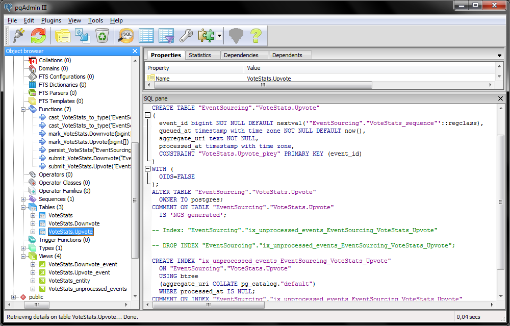
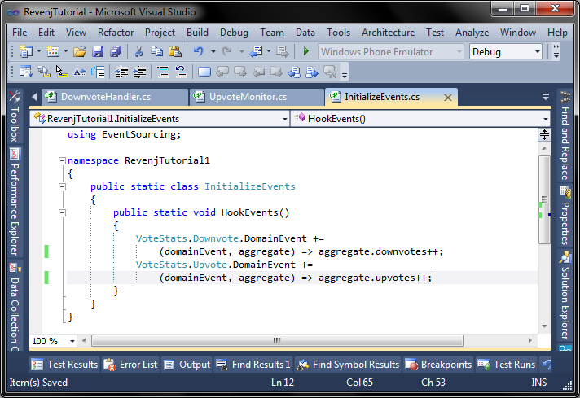
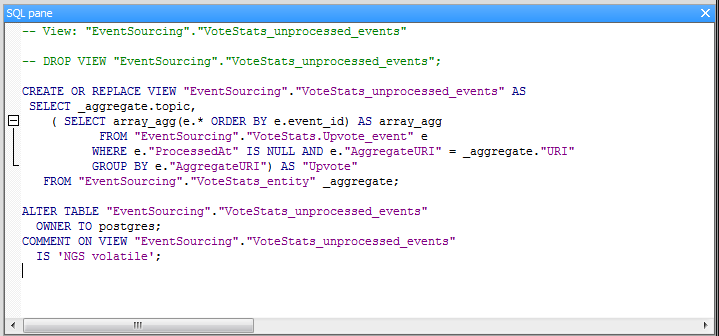
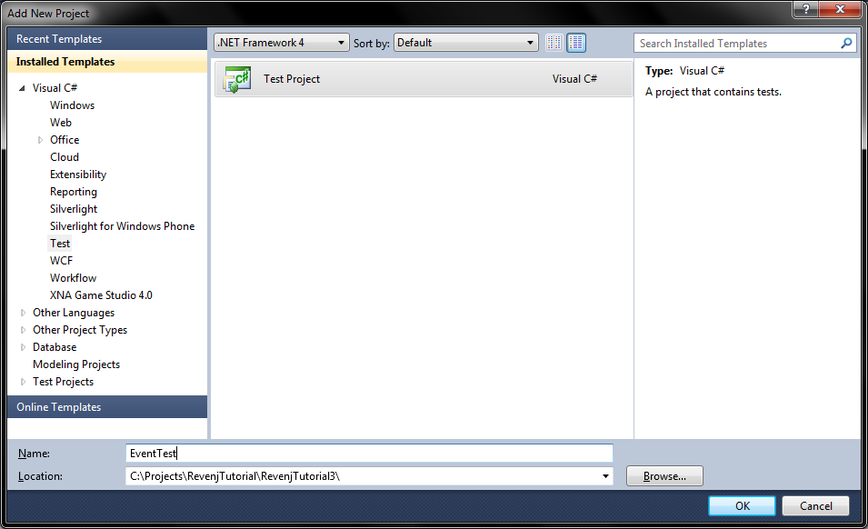
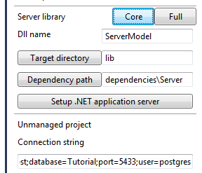
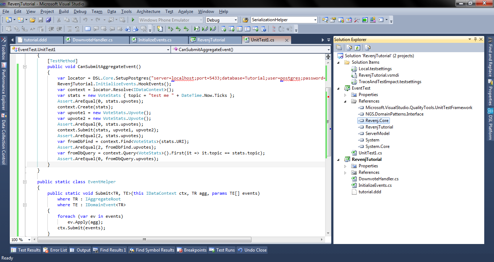
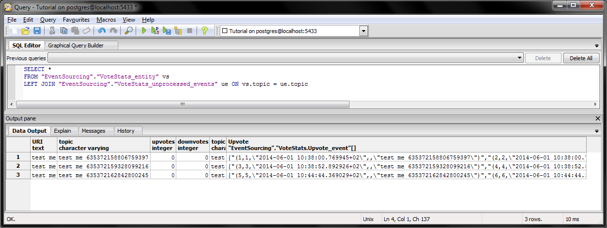
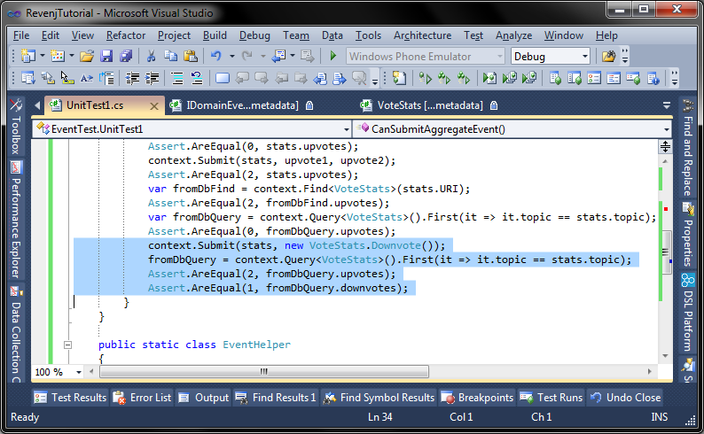
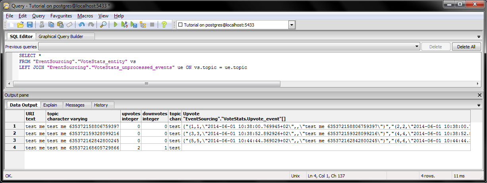

## Event sourcing with aggregate events

In previous event sourcing [tutorial](revenj-tutorial-event-sourcing.md), we've explored domain events in Revenj/DSL Platform. 
There is also a special kind of domain event, which is tied to an aggregate. 
Due to still ongoing research, its DSL representation will probably change and those two separate concepts will probably end up with a same grammar. 

###Aggregate events in DSL

But let's explore the current usage to understand the features they offer and how to implement it. 
We'll write DSL similar to the previous one.

    module EventSourcing {
      aggregate VoteStats(topic) {
        string topic;
        int upvotes;
        int downvotes;
      }
      event VoteStats.Upvote {
        async;
      }
      event VoteStats.Downvote;
    }

An interesting difference is that previous events had a field by which they identified related aggregate (`string(200) topic`), while here they are defined for some aggregate. 
As such they will have additional special field in database and .NET class. 
Let's take a look at the database:

We will see same fields as before, a name matching the DSL and an additional *aggregate\_uri* field. 
This is identity of the referenced aggregate root. 
While we could use actual primary key and referenced the aggregate, basic premise behind events is that they are immutable once created. 
Even if we delete the referencing aggregate from the system we still want events "referencing" that aggregate to remain. 
Thus, referential integrity is somewhat relaxed which could be improved slightly in the future, but for now it's like this.

###Handling aggregate events in code

.NET classes are nested inside aggregate and code for previous tutorial will still work, after we rename *Upvote* and *Downvote* to *VoteStats.Upvote* and *VoteStats.Downvote*. 
But those event handlers are stateful, in a sense they can reference services and change the state of the database (as the current implementation does). 
If we want to have an domain event which can be replayed, we need to have a "handler" which only affects referenced aggregate root.
While there is no way to enforce such a constraint in an imperative language, in practice this means that we need to define replayable event handler differently:

To get this working we need to initialize it during application startup. 
An interesting effect will happen now that we have one async and one synchronous event.

###How everything works together

Since upvote is asynchronous, aggregate root will not be updated in the database, but new events will be created in it. 
Also, database view *unprocessed event* for that aggregate will now look like:

This will be used to fully reconstruct aggregate to its current state if we load it by identity. 
In practice this means that `IRepository<VoteStats>` `Find` method will do a database query for requested aggregates joining with all unprocessed events and reconstruct aggregate by replaying all unprocessed events on it. 
This is hidden away in auto-maintained repository (more glue code which the developer doesn't need to write). 
All he needs to do is hook-up event handler as described above. 
It's also interesting to see how object-relational features of Postgres are utilized, where only one query is sent to the database, regardless of how many aggregate events exists. 
This makes it very performant, while complexity to the developer is not increased.

**Note: Currently `Query` API for *VoteStats* will not reconstruct *VoteStats* fully, but will just use current snapshot in the database.**

Since downvote event is synchronous, our previous handler suffers from same problems as before (concurrency), but had a nice side-effect. Invoking a synchronous event will flush all unprocessed asynchronous events to the database. 
This doesn't have to do much with the Revenj, as it has to do with the current repository implementation DSL Platform provides.

In the end, developers can choose how they want to model the domain; repository implementation is just the reflection of the current model, which does all the heavy lifting, while running on top of Revenj.

As stated before, DSL Platform is all about providing best-patterns implementation. 
With better understanding of events, aggregate events, requirements for the repositories, we expect somewhere down the line to have a merger of events with aggregate events, at least on the DSL level.

###Trying it out

So let's write some code to see how this behaves in practice. 
Instead of consuming it as REST service, let's add some test and work directly on the server:

We'll also use a Revenj-core which is somewhat optimized for use as a library:

We should add reference to the `RevenjTutorial` project, `Revenj.Core` in dependencies/Server, `NGS.DomainPatterns.Interface` to access the signatures, generated model and we should be ready to go. 
Let's write a test which will initialize the Revenj instance, hook up our aggregate event handlers, create an aggregate and apply two async events on it. 
Let's also write an extension method to ease the use of API somewhat, at the end of the test. 
We should have something like this:

 
We can see that the `Find` method will fully reconstruct the aggregate, while the `Query` method will see the snapshot in the database. 
Let's see how this looks in [PgAdmin](http://www.pgadmin.org/):

We see our snapshot version in the database, and two unprocessed events created per aggregate. 
If we add a downvote event to our test and check it again, we will now see that snapshot is up to date, since downvote event is not asynchronous and while processing it also marked previous events as processed.

If we check the database we'll see up-to-date info:

This should get us started on using aggregate events in Revenj.