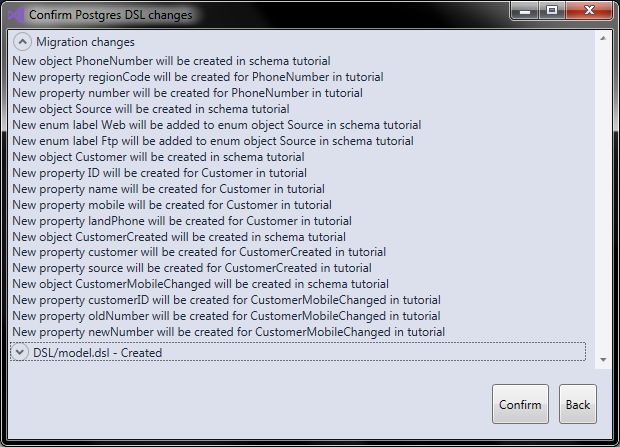
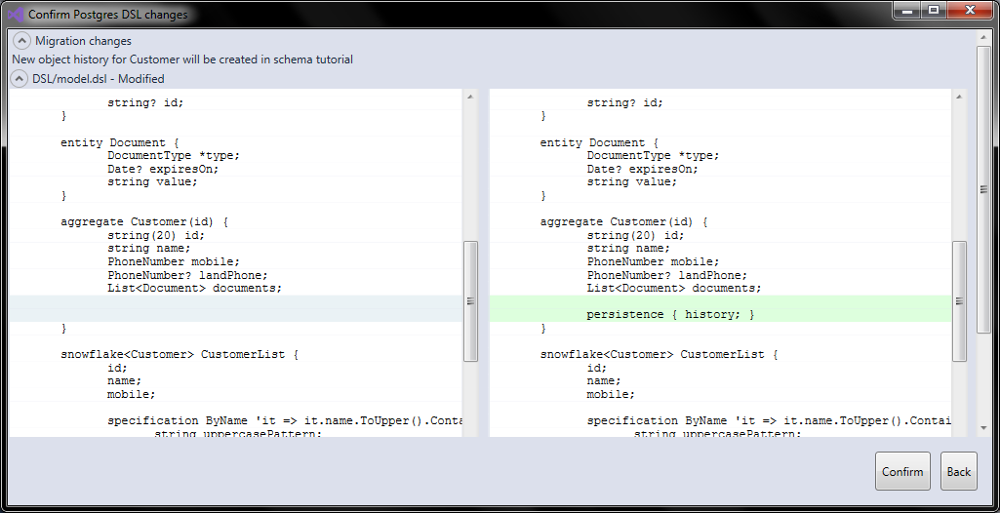

## Using Revenj from ASP.NET core with Postgres and Visual studio

Since v1.5 **Revenj** can be used from .NET core on Postgres database. 
To get most out of Revenj, it should be used in pair with [DSL Platform](https://dsl-platform.com). 
Due to focus on [Domain Specification Language](http://c2.com/cgi/wiki?DomainSpecificLanguage) models it is suited for building both internal applications via [REST service](http://c2.com/cgi/wiki?RestArchitecturalStyle) and for enterprise applications via [CQRS-like](https://www.martinfowler.com/bliki/CQRS.html) style within frameworks such as ASP.NET core. Therefore Revenj can be used in variety of ways: 

- for simple [CRUD](https://en.wikipedia.org/wiki/Create,_read,_update_and_delete) applications, since it provides anemic model paired with repositories.
- for moderately complex [SOA](https://en.wikipedia.org/wiki/Service-oriented_architecture) applications where services handle the business logic and consume models, repositories and various other infrastructure which Revenj provides.
- for highly complex applications built in [DDD](http://dddcommunity.org/resources/ddd_terms/), [CQRS](https://www.martinfowler.com/bliki/CQRS.html) or [event sourcing](https://martinfowler.com/eaaDev/EventSourcing.html) styles where models provided by DSL/Revenj are hidden behind complex aggregates and are used for holding the state.

**Usually, large applications include all of the above.**

This tutorial assumes the knowledge of setting up DSL Platform project and will explain how to build a custom command processing within ASP.NET core paired with services for processing the actual commands. Prerequisites for tutorial are:

 * Postgres (9.6 or newer)
 * ASP.NET core (2.1 or newer)
 * Visual Studio (2017 or newer) with [DSL Platform plugin](https://marketplace.visualstudio.com/items?itemName=RikardPavelic.DDDforDSLPlatform)

Source code used in this tutorial can be [found here](AspNetCore)
 
### Environment setup

To complete the ASP.NET core API project setup:

##### Add Revenj dependencies 

This can be done through Nuget by running:

**PM>** Install-Package Revenj.AspNetCore -Version 1.5.1

##### Setup the model compilation

DSL Platform plugin provides additional window within Visual studio for configuring the project. It can be accessed through *View -> Other Windows -> DSL Platform*. 

 * reference the compiled model dll
 * and configure the Revenj within Startup

### Basic DSL

This tutorial assumes basic knowledge of DSL and various patterns, such as [commands](http://wiki.c2.com/?CommandPattern).

DSL has a lot of building blocks, such as:

 * aggregates and entities
 * value objects
 * events (domain events)
 * commands
 * aggregate events (event sourcing)
 * snowflakes, structs, reports and many others

Complex domain usually consists from most of them. To keep the example simple we will focus on a small model build around the Customer aggregate, with changes coming through commands and log of important changes being reflected in domain events.

DSL model used for creating the customer looks like:

    module Tutorial {
      value PhoneNumber {
        string(2) regionCode;
        string(20) number;
      }

      //data can come from multiple places, eg web or ftp
      enum Source {
        Web;
        Ftp;
      }

      aggregate DocumentType(code) {
        string code;
        string description;
        bool hasExpiryDate;
      }

      command CreateCustomer {
        string name;
        PhoneNumber mobile;
        PhoneNumber? landPhone;
        List<Document> documents;

        string? id;
      }

      entity Document {
        DocumentType *type;
        Date? expiresOn;
        string value;
      }

      aggregate Customer(id) {
        string(20) id;
        string name;
        PhoneNumber mobile;
        PhoneNumber? landPhone;
        List<Document> documents;
      }

      event CustomerCreated {
        Customer customer;
        Source source;
      }
    }

There are several different things in this model:

  * value object *PhoneNumber* - represented as a type in the database and used as a column in the *Customer* table
  * DSL limiting of string length - meaning checks will be included at various places and runtime exceptions (instead of custom validation exceptions) will be thrown. If one prefers to throw user friendly validation exceptions, a different model would have to be written
  * simple enumeration *Source* - while this tutorial will mostly deal with changes comming from the *Web*, in complex applications data can come from various locations, such as being imported from Excel, pulled from FTP or in some other way
  * aggregate with explicit primary key *DocumentType(code)* - DSL is designed to support various non-trivial modeling patterns, such as composite and explicit keys
  * entity used within other aggregate: *Document* - DDD spirit is captured at the core of the modeling process, as **aggregate root** is the encapsulating entity and accessing nested entities is only allowed from within the aggregate (with some other modeling options to work around such a restriction)
  * command *CreateCustomer* which mostly looks like the real aggregate, but is not quite exactly the same - often there are subtle differences in commands which make simple CRUD usage not possible. In this case **id** is populated during command processing and returned to the caller, instead of being specified by the caller
  * this example will assume synchronous processing of the command, so that command instead of only providing a resource for looking up later, will immediately return the relevant info about the created object. If one wanted to follow CQRS style to the letter a different model could have been designed.
  * non-trivial aggregate root *Customer* consisting from 2 value objects and a list of entities - this model is represented with two tables in the database: Customer and Document. It also has some special properties (inheriting parent PK) due to the way how it was modeled
  * domain event *CustomerCreated* - domain events should not be confused with event sourcing, as domain events do not need to represent/capture all the changes to the aggregate (or in the system) and are much more generic concept. There is also a specialized concept which is more suited for event sourcing, but it's not described in this tutorial
  * snapshot of the customer captured in the domain event - since * was not used inside event, the whole object will be captured in the column

### The benefit

Once we have such DSL and run the DSL compile step few things will happen:

 * an SQL migration script will be created. It is created based on the previous state of the DSL (captured in the database - in this setup)
 * DLL which is used from ASP.NET project will be updated to reflect the model

In more complicated project few other things could also happen:

 * Typescript code could be created which would be used to send *CreateCustomer* command from the browser
 * Android jar could be created so our mobile app can consume the same API
 * PHP code could be created which could be used from appropriate framework

The SQL migration consists from a large SQL file (which is quite complicated due to need to rebuild the dependency tree) but has a user friendly description on the top of the relevant changes. This description looks like:

Once you start evolving the model and rerunning the migration, DSL diff will also be useful to understanding what kind of changes have happened from previous point. One important point with SQL migrations is that there are actually two distinct aspects to development:

 * local development and iterations while developing the actual feature/exploring the model
 * migrations between versions in production

While its often fine to drop columns and lose data while doing local iterative development, once model is finished there will often be some custom SQL to cope with the changes. SQL is created in such a way that it will cope with objects manually created before the scripts and thus combines manual and automated process in a seamless way. 

### Implementing the command processing

There are various configuration options for Revenj in ASP.NET core, but in this case we will configure it like:

    WebHost.CreateDefaultBuilder(args)
      .UseRevenj()
        .UseRevenjServiceProvider()
        .WithCommands()
        .Configure("server=localhost;database=tutorial;user=revenj;password=revenj")
      .UseStartup<Startup>();

where several things happend:

 * UseRevenj - starts the Revenj configuration
 * UseRevenjServiceProvider - will replace default ASP.NET core Dependency injection with Autofac built into Revenj. This is not mandatory and most of the time it's not really required
 * WithCommands - loads and configures Revenj plugin commands which will be called
 * Configure(connection string) - binds a connection string with Revenj configuration

If we want to use default Revenj API endpoints we also need to configure *IApplicationBuilder* using `app.UseRevenjMiddleware()` which enables Revenj REST API within ASP.NET core. In complex applications its preferable not to use generic middleware, but rather to recreate only the relevant endpoint so custom logic/authentication can be bound to it.

Such implementation in a Controller or a custom Middleware would look like:

    [HttpPost("{command}")]
    public Task Submit(string command)
    {
      var type = domainModel.Find(command);
      if (type == null || !typeof(ICommand).IsAssignableFrom(type))
        return ReturnError(HttpContext.Response, $"Invalid command: {command}", 400);
      var genType = typeof(ExecuteCommand<>).MakeGenericType(type);
      var execute = (IExecuteCommand)Activator.CreateInstance(genType)
      return execute.Submit(serialization, objectFactory, HttpContext);
    }

    interface IExecuteCommand
    {
      Task Submit(IWireSerialization serialization, IObjectFactory objectFactory, HttpContext http);
    }

with a (naive) implementation for execute command such as:

    public class ExecuteCommand<T> : IExecuteCommand
      where T : ICommand
    {
      public Task Submit(IWireSerialization serialization, IObjectFactory objectFactory, HttpContext http)
      {
        var command = (T)serialization.Deserialize(http.Request.Body, typeof(T), http.Request.ContentType, new StreamingContext(StreamingContextStates.All, objectFactory));
        Dictionary<string, List<string>> errors;
        using (var context = objectFactory.DoWork())
        {
          context.Submit(command);
          errors = command.GetValidationErrors();
          http.Response.ContentType = "application/json";
          if (errors.Count == 0)
          {
            context.Commit();
            http.Response.StatusCode = 200;
            serialization.Serialize(command, "application/json", http.Response.Body);
          }
          else
          {
            http.Response.StatusCode = 400;
            serialization.Serialize(errors, "application/json", http.Response.Body);
          }
        }
        return Task.CompletedTask;
      }

Better implementation would handle request types other than JSON and would have more error handling. Several Revenj specific patterns are found in this short implementation:

 * *IWireSerialization* service - which by default handles JSON/XML and Protocol Buffers. It accepts mime type and returns mime type of the serialized output.
 * new StreamingContext deserialization argument - Document entity was defined with a lazy load and thus requires full initialization with service provider/object factory  
 * *ICommand* signature - which has **GetValidationErrors()** method for looking up logged errors. This is useful for converting errors into a Javascript friendly path for convenient error mapping on the frontend
 * *IObjectFactory.DoWork()* **unit of work** - for starting a new transaction with the *IDataContext* API. Instead of using repositories directly, this layer can be used which calls into actual repositories
 * explicit *context.Commit()* call for committing the transaction - otherwise call to *Dispose()* will rollback current DB changes
 * currently Revenj does not have Async DB API - which is sufficient for most applications which work with the database, but it's not ideal for all use cases

This provides us with a generic API for accepting any command, but we now need a different way to handle each command. With the current implementation calling the command would be done via:

    POST /revenj/module.Command

    { JSON attributes }

### Handling the actual command

Revenj supports the `IDomainEventHandler<T>` signature for detecting implementations for handling commands/events. Different signatures can be used (e.g. `T[]` for bulk processing), but in this case to handle the *CreateCustomer* command we need to write a public implementation of `IDomainEventHandler<CreateCustomer>`

While we could write logic inside the handler, it's much better to just pass the call into the appropriate service and handle all the permissions and business logic there. This way we've replaced writing ASP.NET controllers with writing handlers.

Once we start using the same services from other places it becomes apparent why having **all the validations and business logic at a single place** - in the service - is preferable.

An implementation of a handler could look like:

    public class ModifyCustomerHandler : IDomainEventHandler<CreateCustomer>
    {
      private readonly ICustomerService service;

      public ModifyCustomerHandler(ICustomerService service)
      {
        this.service = service;
      }

      public void Handle(CreateCustomer command)
      {
        service.Create(new[] { command }, Source.Web);
      }
    }

    public interface ICustomerService
    {
      void Create(IEnumerable<CreateCustomer> commands, Source source);
    }

One important detail is visible from the service signature - **API signature deals with processing in bulk**. Unless service APIs are defined to work on sets of data, over time instance call problem spreads through the codebase. Convenient workaround for such problem is to define public APIs as collections, even with the naive implementations just doing simple loops. This allows service to prepare all the relevant data it needs for processing before entering the loop.

### Implementing the service API

To implement the service for processing the command some design decisions must be made:

 * will service be singleton or scope (context) based
   * if it's a singleton we need to pass in context parameters into all methods, otherwise we can take context dependencies in the constructor
 * how to register the service in the container
   * this can be done in the composition root, for example using the ASP.NET *IServiceCollection* signature inside *Startup*
   * it can be done while composing the module (in Revenj this is done via *ISystemAspect* signature)
   * by using appropriate annotation - Revenj has a *Service* annotation for such purpose

In larger applications registration is usually done in module composition and modules are assembled during startup to achieve dynamic modularization. But for this purpose we will use the least favorite way - registration via annotation on the service. Our service will look like:

	[Service(InstanceScope.Context)]
	public class CustomerService : ICustomerService
	{
      private readonly IDataContext context;

      public CustomerService(IDataContext context)
      {
        this.context = context;
      }

      public void Create(IEnumerable<CreateCustomer> commands, Source source)
      {
        var newCustomers = new List<Customer>();
        var existingIDs = commands.Where(it => !string.IsNullOrEmpty(it.id)).Select(it => it.id);
        var existingCustomers = context.Find<Customer>(existingIDs).ToDictionary(it => it.id, it => it);
        var hasErrors = false;
        foreach (var c in commands)
        {
          var customer = new Customer { id = ValidateID(c, existingCustomers, source) };
          customer.name = ValidateName(c, c.name);
          customer.mobile = ValidatePhone(c, c.mobile, nameof(c.mobile));
          customer.landPhone = ValidatePhone(c, c.landPhone, nameof(c.landPhone));
          customer.documents = ValidateDocuments(c, c.documents);
          hasErrors = hasErrors || c.GetValidationErrors().Count != 0;
          newCustomers.Add(customer);
        }
        if (!hasErrors)
        {
          context.Create(newCustomers);
          var eventLog = newCustomers.Select(c => new CustomerCreated { customer = c, source = source });
          context.Submit(eventLog);
        }
      }

      private static string ValidateID(CreateCustomer command, Dictionary<string, Customer> existingCustomers, Source source)
      {
        if (source == Source.Web)
        {
          if (!string.IsNullOrEmpty(command.id)) command.LogError(nameof(command.id), "ID can't be set");
          //simplistic way to create new id
          command.id = Guid.NewGuid().ToString().Replace("-", "").Substring(0, 15);
        }
        else
        {
          if (string.IsNullOrEmpty(command.id)) command.LogError(nameof(command.id), "ID must be provided");
          else if (existingCustomers.ContainsKey(id)) command.LogError(nameof(command.id), "ID already taken");
          else command.id = id;
        }
        return command.id;
      }

      private static string ValidateName(CreateCustomer command, string value)
      {
        if (value.Length < 2) command.LogError(nameof(command.name), "Name is too short");
        else if (newValue.Length > 100) command.LogError(nameof(command.name), "Name is too long");
        return value;
      }

      private static PhoneNumber ValidatePhone(CreateCustomer command, PhoneNumber value, string path)
      {
        if (value.regionCode.Length != 2) command.LogError($"{path}.{nameof(value.regionCode)}", "Region code missing");
        else if (!value.number.StartsWith('+')) command.LogError($"{path}.{nameof(value.number)}", "Phone number must start with +");
        else if (value.number.IndexOf('+') != value.number.LastIndexOf('+')) command.LogError($"{path}.{nameof(value.number)}", "Only one + per number allowed");
        //...
        return value;
      }

      private static List<Document> ValidateDocuments(CreateCustomer command, List<Document> newDocuments)
      {
        for (int i = 0; i < newDocuments.Count; i++)
        {
          var d = newDocuments[i];
          var dt = d.type;
          if (dt.hasExpiryDate && d.expiresOn == null)
            command.LogError($"{nameof(CreateCustomer.documents)}[{i}].{nameof(Document.expiresOn)}", "Expiry date must be provided");
          if (string.IsNullOrEmpty(d.value))
            command.LogError($"{nameof(CreateCustomer.documents)}[{i}].{nameof(Document.value)}", "Value can't be empty");
        }
		return newDocuments;
      }
    }

Clear and concise error reporting is very important. This is the main reason why usually most of the code in services deals with errors. While writing the happy path is mostly trivial, **writing understandable error messages is paramount**. There are various ways to reuse the *same* validations on different places (Javascript vs C#) but this is outside of scope of this article. Regardless, there are several important aspects of the service to discuss:

 * service was registered per context, meaning a shared instance within a scope. This way we can take context dependencies in the constructor which will simplify service signatures at the cost of service allocation in each context
 * bulk API is showing its importance by preloading all relevant data used for validation. While this is not important for Web based call which work on a single instance, it is important if we are calling the same API for doing the bulk import
 * different rules for validations can be combined with same rules. In this case a rule for customer ID is that from FTP is will be taken as is, but for WEB it will be created on the spot
 * nameof feature is showing its usefulness by allowing us to write typesafe paths
 * while this Validate methods look boilerplatey, they can be extracted into a shared location and reused across various calls.
 * even with failing validations we can proceed further and continue accumulating errors for different commands
 * path to errors can be non-trivial as in case of documents and business rule for expiry date
 * there is some implicit lazy load happening while loading document type in `var dt = d.type;`. While its preferable to avoid lazy load most of the time, in this case due to type of the aggregate we are dealing with its prudent to attach caching to it. That way lazy load will not hit the database, but will rather lookup data from memory

Some aspects of error validations are not shown here - e.g. how to cope with changes to the fields. Validation can only be applicable when a value of the field changes. For complex applications which can configure field visibility in runtime this becomes an important part of the validation

The last part of our service API is leaving the trail of an domain event - an important business information which was requested to be captured. In this case this is *CustomerCreated*.

The naming difference between a command: *CreateCustomer* and an domain event: *CustomerCreated* shows an important distinction between them. **With command we tell system what to do, with domain event we log in the system what has happened**.

To enable caching of aggregates it's sufficient to specify caching type and attach it to appropriate aggregate:

    caching {
      eager for DocumentType;
    }

This will keep all record of DocumentType in memory and will reload them as soon as they are changed (and committed) in the database.

### The whole backend process

Now all the parts are in place and we can look into how they work together. By sending a POST request like this:

    POST /revenj/tutorial.CreateCustomer

    {"name":"my name","mobile":{"regionCode":"HR","number":"+3859512345678"}}

we will save our first customer and the appropriate customer created event.

If we want to use documents in our request, we first must define some document types, or we can encode some system wide document types inside the DSL. It's a common pattern that aggregates have few system instances which are predefined; in this case we could write our aggregate with few static definitions:

    aggregate DocumentType(code) {
      static Passport 'Passport';
      static DriverLicense 'DriverLicense';
      string code;
      string description;
      bool hasExpiryDate;
    }

If there are no DocumentType instances during startup with value of 'Passport' or 'DriverLicense' Revenj will fail to start with an error. We can either use an SQL script which will be executed before/after the migration, or we can inject the SQL inside the migration via appropriate concept:

    postgres code <#
      INSERT INTO tutorial."DocumentType" 
      VALUES ('Passport', 'Passport', true), ('DriverLicense', 'Driver license', true)
      ON CONFLICT DO NOTHING;
    #>;

Now we can use documents in JSON API:

    POST /revenj/tutorial.CreateCustomer

    {"name":"my name","mobile":{"regionCode":"HR","number":"+3859512345678"},"documents":[{"typeURI":"Passport","value":"123456"}]}

Due to deserialization with objectFactory and passing in the *typeURI* we can access the type rich object on *Document*.

For this request a 400 with `application/json` will be returned due to validation that passport must have expiry date set:

    {"documents[0].expiresOn":["Expiry date must be provided"]}

Once we provide expiry date in the JSON data will be stored as expected.

Many developers spend significant time in the debugger, often to just gain a better understanding of the underlying framework/instrastructure. This is one of the major benefits of open source where one can step into the code and understand what is going on. For this reason its often useful to debug the compiled libraries generated from the DSL Platform for the Revenj.

Visual studio plugin keeps the source code in memory and only creates the library as an output. Often its prudent to use a different tool such as [DSL-CLC CLI](https://github.com/ngs-doo/dsl-compiler-client/releases) to compile library with debug info or have the source used directly in the project for debugging. This can be done by running commands such as:

    java -jar dsl-clc.jar revenj.net=lib\Model.dll dsl=DSL nuget=revenj:1.5.1

Which will create the same DLL output but with debug info. We can also redirect the source to appropriate folder, or just create the source instead of compiled library. 

### Reimplementing CRUD-like flow

Command is rather generic API and if we consider Query as specialized version of a command then we can implement all communication with the server via commands:

 * *CreateCustomer* - as a Create request
 * new command *ChangeCustomer* - similar to Update request
 * we will avoid the delete command - since we don't allow deleting customers
 * *LookupCustomer* for reading a single customer object
 * and command for searching - *SearchCustomers* which will return different customer objects optimized for listing - and will also provide a search criteria

Other commands can look like:

    command ChangeCustomer {
      string id;
      string name;
      PhoneNumber mobile;
      PhoneNumber? landPhone;
      List<Document> documents;
    }
 
    command LookupCustomer {
      string(20) id;
      Customer? result;
    }

    snowflake<Customer> CustomerList {
      id;
      name;
      mobile;
    }

    command SearchCustomers {
      string(30) nameMatch;
      CustomerList[]? result;
    }

When comparing *Create* and *Change* customer commands we can notice that there is only a minor difference:

 * the create customer returns the id as a result
 * the change customer expects the id as input parameter

In practice there are often few other differences in non-trivial commands. We can extract the shared signature into a **mixin** which will allow us to also reuse code at various places:

    mixin CustomerMixin {
      string name;
      PhoneNumber mobile;
      PhoneNumber? landPhone;
      List<Document> documents;
    }

    command CreateCustomer
    {
      has mixin CustomerMixin;
      string? id;
    }

    command ChangeCustomer
    {
      string id;
      has mixin CustomerMixin;
    }

While mixin increase code reuse and reduces minor differences across objects, it comes at a price of less readability. This is often resolved by showing DSL in a different way, rather than in the raw way as it was written.

SearchCustomers command which returns list of snowflakes found by search criteria needs a way to do the actual search. This can be done in multiple ways:

 * by defining search implementation inside DSL - e.g. by writing specification or report
 * through implementing query within Revenj LINQ provider
 * by writing raw SQL for filtering and calling into Revenj mapping for DB -> C# conversion

Most of the time it makes sense to define search criteria inside DSL. Often this will create a specialized DB function which can be consumed. Sometimes, for complex queries it's better to pass in query with explicit parameters from the client than call into DB function which optimizes query differently. For this case we will use **specification** which will create a DB function and is the preferred way of interacting with database:

    specification<CustomerList> ByName 
      'it => it.name.ToUpper().Contains(uppercasePattern)' 
    {
      string uppercasePattern;
    }

Revenj has an advanced and extensible LINQ driver which converts C# into a close representation of SQL query. We can now write handlers for the commands and appropriate service implementations:

    public class ViewCustomerHandler : IDomainEventHandler<SearchCustomers>
    {
      private readonly ICustomerService service;

      public ViewCustomerHandler(ICustomerService service)
      {
        this.service = service;
      }

      public void Handle(SearchCustomers command)
      {
        command.result = service.Search(command.nameMatch.ToUpper());
      }
    }

      //service implementation
      public CustomerList[] Search(string name)
      {
        return context.Search(new CustomerList.ByName(uppercasePattern: name.ToUpper()));
      }

We could have implemented the searching directly in the handler and this is sufficiently good for simple or internal applications. The main reason why it's preferable to implement actual service method is since it's the obvious place to put additional validations/conversions/permission checks. 

There are various concepts for defining security within DSL, such as roles, permissions and filters. Using *IPermissionManager* is outside of scope of this article, but we will show how to define general roles and permission rules which encode security rules within the domain:

    role MANAGE_CUSTOMERS;
    role VIEW_CUSTOMERS;

    permissions {
      allow CreateCustomer for MANAGE_CUSTOMERS;
      allow ChangeCustomer for MANAGE_CUSTOMERS;
      allow SearchCustomers for VIEW_CUSTOMERS;
      allow LookupCustomer for VIEW_CUSTOMERS;
    }

Above roles and permissions can be used to check if the **IPrincipal** has access to the relevant commands. While fine tuning row visibility can be done in the DSL definitions, its often as good to define it within code.

One important aspect of Revenj is that serialization is defined by `Content-Type` and `Accept` headers of the request instead of the controller definitions. While in practice this means that you can send requests such as:

    POST /revenj/tutorial.SearchCustomers

    Content-Type: application/json
    Accept: application/xml

    {"nameMatch":"2"}

and get the expected response:

    HTTP/1.1 200 OK
    Content-Type: application/xml

    <SearchCustomers xmlns:i="http://www.w3.org/2001/XMLSchema-instance">
      <nameMatch>2</nameMatch>
      <result>
        <CustomerList><URI>c45dce83ef5d458</URI><id>c45dce83ef5d458</id><mobile><number>+123456</number><regionCode>HR</regionCode></mobile><name>customer 2</name></CustomerList>
        <CustomerList><URI>8e3f228c50444be</URI><id>8e3f228c50444be</id><mobile><number>+234567</number><regionCode>HR</regionCode></mobile><name>customer 22</name></CustomerList>
      </result>
    </SearchCustomers>

A similar API is available in the built-in middleware and can be accessed through:

    POST /Domain.svc/submit/tutorial.SearchCustomers?result=instance

The main diference is the `result=instance` argument which specifies that instead of just getting an ID of an command/event we get the whole instance back. If the command was write only it would make sense to omit the the argument.

Alternative way of calling commands which are read only is by using queries. They can be defined in DSL as a specialization of a command. For search customer which has a string as input parameter and a list of customers as an output parameter a query can be defined:

    Query<SearchCustomers> Search accepts nameMatch returns result;

Now it can be called though the built-in API:

    PUT /Reporting.svc/query/tutorial.Search
    Accept: application/json
    Content-type: application/json

    "search filter"

and get back just the list of customers

    [
      {"id":"8e3f228c50444be","name":"customer 1","mobile":{"regionCode":"HR","number":"+123456"},"URI":"8e3f228c50444be"},
      {"id":"c131d91f9e714b1","name":"customer 2","mobile":{"regionCode":"HR","number":"+234567"},"URI":"c131d91f9e714b1"}
    ]
 
### Leaving a trail of logs

Edit-like command is not a good candidate for event sourcing, or leaving a trail of all events which change the data since it would need to be captured with *CustomerChanged* domain event while business is usually interested in *MobileChanged* and similar domain events. While its good practice to capture domain events which business defined, unless all changes are logged in events, it's a good practice to enable history concept on an aggregate which will leave trail of all changes to the aggregate. And if some time later business requires log of new domain events, such as *PassportChanged* this can be reconstructed from existing history log, or often reconstructed just in time if there are no analytics requirements for it.

Modeling of such events can look like:

    event CustomerMobileChanged {
      Customer *customer;
      PhoneNumber? oldNumber;
      PhoneNumber? newNumber;
    }

    event CustomerPassportChanged {
      relationship<Customer> customer;
      Document? oldPassport;
      Document? newPassport;
    }
 
where we capture both the new and the old value with a reference to the actual aggregate. Unlike the *CustomerCreated* where we captured the entire customer aggregate, only the relevant information is capture here. There is one important distinction between the events, how the *customer* is referenced. The first one represents a relationship + a lazy load property on the event. Its preferable to model it in the second way unless the cache is defined for the aggregate. This way lazy load problems are avoided. 

### Conclusion

Revenj supports different kinds of modeling and teams should choose the one which fits their use case the best. Systems often have different architecture styles in different parts of the application - which is often desired instead of trying to do entire application in a single style.

Revenj also suggest architectures which are independent of the underlying framework its running on.
This way application written for Revenj running in legacy ASP.NET should work without almost any refactoring in Revenj running in ASP.NET core.  