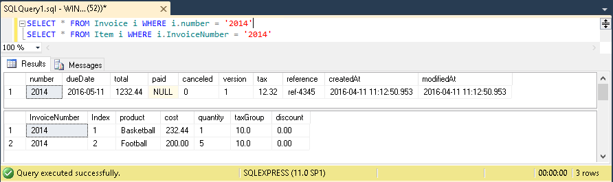

## Bulk reading multiple queries

#### Utilizing ORDBMS features

PostgreSQL and Oracle are object-relational databases and as such support more complex query projections then relational-only database.
Several scenarios of such usage is already covered in [NoSQL documents tutorial](revenj-tutorial-nosql-documents.md).
This is rarely used in real world due to several major reasons:

 * popular ORMs don't support such queries (out of the box or at all)
 * writing and maintaining such queries is problematic (due to fragile setup)
 * maintaing convertes in code is problematic (only practical with in house code generators)

Some realational databases (such as MS SQL Server) also have other features, such as support for [multiple queries](https://msdn.microsoft.com/en-us/library/ms378758(v=sql.110).aspx) in a single roundtrip.

In practice this means that on MS SQL Server, DSL such as:

    aggregate Master(number) {
      int number;
    }
    aggregate Detail {
      Master *master;
      string product; 
    }

can be looked up by primary key in a single query such as:

    SELECT * FROM Master WHERE number = @id
    SELECT * FROM Detail Where masterID = @id

which will return two recordsets. Together they can represent a single complex aggregate.

While this works very well for lookups, it's not ideal way to query complex data sources since level of nesting is rather limited.

ORDMBS support for alternative query methods, such as:

    SELECT m, AGGREGATE(SELECT d FROM Detail d WHERE d.masterID = m.number) as details
    FROM Master m
    WHERE m.number = @id

which is more generalized query projection of such a model and can be arbitrarily nested.

#### DSL report concept

While PostgreSQL does support queries with complex projections, it doesn't really has multiple queries feature equivalent to MS SQL Server.
It does have some workarounds to achieve such feature in a different way; and it also has much more advanced type system which allows for such a feature in a totally different way.

DSL has a report concept which has several usages, one of them is to aggregate several queries in a single place. DSL such as:

    report MultipleQueries {
      int id;
      set<int> alternatives;
      string productName;
      Master master 'it => it.number == id';
	  count<Master> others 'it => alternatives.Contains(it.number)';
	  List<Detail> products 'it => it.product.Contains(productName) || it.masterID == master.number' LIMIT 10;
    }

which will translate into database function. 
In PostgreSQL that function will have three arguments (id, alternatives and productName) and will return three columns (master, others and products) which fills the role of three queries to the database.
Function in the database looks something along the lines of:

    CREATE FUNCTION MultipleQueries(id int, alternatives int[], productName varchar, OUT master Master, OUT bigint others, OUT Detail[] products)
      RETURNS void AS $$
      //...
      SELECT it INTO master FROM Master it WHERE it.number = id;
      SELECT count(it) INTO others FROM Master it WHERE it.number = ANY(alternatives);
      SELECT array_agg(it) INTO products FROM Detail it WHERE it.product LIKE '%' || productName || '%' OR it.masterID = master.number LIMIT 10;
    $$ END LANGUAGE PLPGSQL;

which has three out parameters and returns a single row. 
Revenj can deserialize such query from database which passes through JDBC as an ordinary string.

#### Runtime bulk reading

Report concept must prepare database function and invoke it to get the results. 
This also have some downsides such as:

 * PostgreSQL will execute such queries in a prepared way (meaning it doesn't use statistics per arguments) which can sometimes (although rarely) lead to non optimal plans
 * it requires a database migration (although such migrations will not affect data, sometimes it's not feasible to apply migration when we want to run a new query)

There is also alternative way of doing multiple queries within the Revenj; and this is through [repository bulk reader interface](https://github.com/ngs-doo/revenj/blob/master/java/revenj-core/src/main/java/org/revenj/patterns/RepositoryBulkReader.java).
There are some differences, but also a lot of commonalities between the approaches:

 * creates SQL in runtime
 * can't use results of previous query as arguments in the next query

Both approaches support wide range of queries, such as:

 * lookups by pk(s)
 * search from predicate
 * count/exists
 * [OLAP](revenj-tutorial-olap-basics.md)

which means it's suitable for very complex data access.
In Java equivalent query can be created as:

    RepositoryBulkReader reader = locator.resolve(RepositoryBulkReader.class);
    Callable<Optional<Master>> master = reader.find(Master.class, id.toString); //int id
	Callable<Long> others = reader.count(Master.class, it -> alternatives.contains(it.getNumber()));
	Callable<List<Detail>> products = reader.search(Detail.class, it -> it.getProduct().contains(productName) || it.getMasterID() == id, 10, null);
	reader.execute(); // will create and run the actual query after which callable can be queried for actual values.

This allows for very performant queries when there is noticeable latency over database link.
