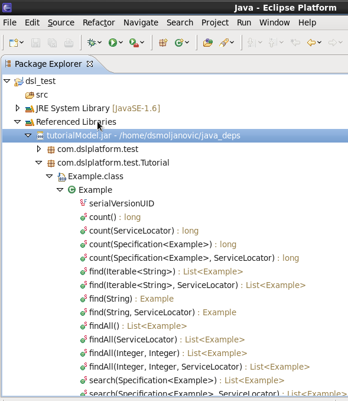
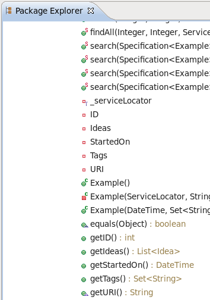

## DSL command line client (linux stack)

###Information
Running DSL stack requires database (postgres or oracle), and Revenj running either on IIS or mono. This chapter will describe how to use DSL command line client (dsl-clc) on linux stack using mono to run Revenj application server. We will not describe setting up mono or the database; for that please consult separate guides:
- Setting up database for DSL platform
- Setting up mono for Revenj

##Configure DSL command line client
###Basic prerequisites and concepts
As mentioned in chapter above, this tutorial assumes you already have setup the basic infrastructure:

1. postgres database (9.1 or newer)
2. database user with sufficient permissions
3. mono (3.2 or newer) for running Revenj

Along with the infrastructure, following is good to have before configuring clc:

1. directory where to store Revenj and generated model dll file. This is location where CLC will download Revenj dependencies and location pointed to from Revenj property ServerAssembly inside it's configuration file(App.config). We'll call this directory REVENJ_PATH.
2. directory where to store generated java library. This library should be included as a dependency inside your project. We'll call this directory JAVA_PATH
3. have a registered account on dsl-platform.com; these credentials are needed for clc to run and compile DSLs
4. choose prefered language and namespace for generated classes. In this tutorial we will use java and "com.dslplatform.test" for our namespace.
5. download dsl-clc jar file. It is available on this link: https://github.com/ngs-doo/dsl-compiler-client/releases

## Basic DSL-CLC tutorial
### Revenj
**Revenj** is a framework for .NET and Mono with support for Postgres and Oracle databases. While it can be used as any other framework, it's rather small (feature wise) and it's best used as a backend for [DSL Platform](https://dsl-platform.com). This makes it ideal as a [REST service](http://c2.com/cgi/wiki?RestArchitecturalStyle) built on [DSL](http://c2.com/cgi/wiki?DomainSpecificLanguage) models, or within some other framework such as ASP.NET. 

- Revenj contains [LINQ](http://msdn.microsoft.com/en-us/library/bb397926.aspx) providers for Postgres and Oracle, somewhat different from other LINQ providers since it leverages object-oriented features of those databases. This allows for having a [NoSQL documents](http://en.wikipedia.org/wiki/Document-oriented_database) inside a relational databases.
- Revenj also supports various serializations out of the box, such as: Json, Protobuf and XML.
- Inversion of control is used to bind various services together and Autofac (slightly modified) is the default container.
- Advanced features such as [AOP](http://docs.castleproject.org/Windsor.Introduction-to-AOP-With-Castle.ashx) are supported, which means aspects can be registered to utilize various inspections and fixes, without providing alternative service implementations.
- Plugin based architecture allows for easy extensions without code changes or recompilations. Signature based extensions are utilized, so even convention or configuration are not necessary, since services are picked up by their signature, not their name or explicit wiring.

In this tutorial we will use it as a REST service to show off why Revenj/DSL Platform is useful. To get started, we'll need a DSL Platform account, Postgres (9.1 or newer) and Mono (3.2 or newer). DSL Platform is a DSL compiler (available for free as an online service, or can be licensed for offline installation) which converts provided DSL model to target code/SQL.

###DSL introduction

Let's start with a minimal DSL and a simple [CRUD](http://en.wikipedia.org/wiki/Create,_read,_update_and_delete) operation to get a feeling what's happening.

Minimal useful DSL we can write is:

    module Tutorial {
      aggregate Example;
    }

This code is syntax sugar and it is almost equivalent to a slightly longer DSL:

    module Tutorial {
      aggregate Example(ID) {
        int ID { sequence; }
      }
    }

We have a module named Tutorial which will be mapped to Tutorial package in java, to schema Tutorial in Postgres and an [aggregate root](http://dddcommunity.org/resources/ddd_terms/) Example (think of it as a master entity). ID is automatically generated by the database as a unique key since we utilized sequence concept.

To CRUD it we can use [REST-like API](https://github.com/ngs-doo/revenj/blob/master/Code/Plugins/Revenj.Plugins.Rest.Commands/ICrudCommands.cs) available in a plugin DLL provided with Revenj.

Rest plugin is using WCF signature for defining endpoint and is available (by default) via `/Crud.svc/Tutorial.Example` url.

###Configuring DSL Platform CLC

For the rest of the tutorial we will assume you have already installed all prerequisits as well as downloaded and installed CLC. Please set JAVA_HOME environment variable to your valid JDK path.

First, create a new .props (let's call it my.props) file and fill it with configuration values for your environment. For our example we will use these values:

	# DSL credentials
	u=<your dsl platform login>
	p=<your dsl platform password>
	# Namespace for generated java classes
	namespace=com.dslplatform.test
	# Path for generated java library that will contain the classes
	java_client=./java_client/tutorialModel.jar
	# Path to directory where SQL migration script will be generated
	sql=./migrationDirectory
	# Path for generated server model library
	revenj=./server/ServerModel.dll
	# Path that contains all our .dsl files for the project
	dsl=./dsl
	# Database connection string (postgres in this case)
	db=localhost:5432/ngsdb?user=ngsDBUser&password=ngsDBPass
	# Targets for which client will download dependencies (we use java)
	target=java_client,revenj
	# Write output
	log
	# Create SQL migration script
	migration
	# Apply the SQL migration script to the database
	apply

We will use CLC to compile the DSL file. It will generate java library  for our project and download all library dependancies that are needed for the project; create and run a database migration script; generate a ServerModel.dll file that will be used by Revenj server AND download latest Revenj version. After that we will do few configuration steps.
So let's start.

#### 1. Create DSL file

Create a new file inside a directory that is specified by the "dsl" parameter in your .props property file. 

#### 2. Run CLC

We will now use DSL command line client to run one action that will do several things at once using our DSL file: parse the DSL file for errors, generate SQL script, automaticaly apply the SQL script to the database, generate target library and generate server library. Also it will download target client dependencies and download latest version of Revenj. This is all done by this command:

    java -jar dsl-clc.jar -properties=my.props

Output will be as follows:
	
	Java client not found in: /var/mono/wwwroot/clc/./java_client
	Do you wish to download latest Java client version from the Internet (y/N): y

Enter **y** to accept and clc will download client libraries to java_client folder.

	Cannot run program "mvn": CreateProcess error=2, The system cannot find the file specified
	Downloading Java client from DSL Platform...
	Downloading java-client.zip ...
	Unpacked: slf4j-api-1.7.7.jar. Size: 28kB
	Unpacked: aws-java-sdk-1.7.11.jar. Size: 12201kB
	Unpacked: commons-codec-1.9.jar. Size: 257kB
	Unpacked: commons-io-2.4.jar. Size: 180kB
	Unpacked: commons-logging-1.1.3.jar. Size: 60kB
	Unpacked: dsl-client-core-0.4.15.jar. Size: 13kB
	Unpacked: dsl-client-http-0.4.15.jar. Size: 50kB
	Unpacked: hamcrest-core-1.3.jar. Size: 43kB
	Unpacked: httpclient-4.3.3.jar. Size: 575kB
	Unpacked: httpcore-4.3.2.jar. Size: 275kB
	Unpacked: jackson-annotations-2.1.1.jar. Size: 33kB
	Unpacked: jackson-core-2.1.1.jar. Size: 201kB
	Unpacked: jackson-databind-2.3.3.jar. Size: 894kB
	Unpacked: joda-time-2.3.jar. Size: 567kB
	Unpacked: junit-4.11.jar. Size: 239kB
	Unpacked: logback-classic-1.1.2.jar. Size: 264kB
	Unpacked: logback-core-1.1.2.jar. Size: 417kB
	Unpacked: dsl-client-http-apache-0.4.15.jar. Size: 18kB	
	Revenj dependencies not found in: /var/mono/wwwroot/clc/./revenj
	Do you wish to download latest Revenj version from the Internet (y/N): y

Another prompt asking us to download revenj dependencies. Answer **y** 

	Downloading Revenj from Github...
	Unpacked: Revenj.Http.exe. Size: 43kB
	Unpacked: Autofac.Configuration.dll. Size: 30kB
	Unpacked: Autofac.dll. Size: 212kB
	Unpacked: Autofac.Integration.Mef.dll. Size: 21kB
	Unpacked: Castle.Core.dll. Size: 424kB
	Unpacked: LitS3.dll. Size: 46kB
	Unpacked: Mono.Security.dll. Size: 285kB
	Unpacked: Newtonsoft.Json.dll. Size: 419kB
	Unpacked: NGS.Common.dll. Size: 6kB
	Unpacked: NGS.DatabasePersistence.Interface.dll. Size: 8kB
	Unpacked: NGS.DatabasePersistence.Postgres.dll. Size: 137kB
	Unpacked: NGS.DomainPatterns.dll. Size: 41kB
	Unpacked: NGS.DomainPatterns.Interface.dll. Size: 20kB
	Unpacked: NGS.Extensibility.dll. Size: 110kB
	Unpacked: NGS.Extensibility.Interface.dll. Size: 35kB
	Unpacked: NGS.Features.Mailer.dll. Size: 22kB
	Unpacked: NGS.Features.Storage.dll. Size: 12kB
	Unpacked: NGS.Logging.Interface.dll. Size: 5kB
	Unpacked: NGS.Logging.NLog.dll. Size: 5kB
	Unpacked: NGS.Plugins.DatabasePersistence.Postgres.dll. Size: 47kB
	Unpacked: NGS.Security.dll. Size: 17kB
	Unpacked: NGS.Security.Interface.dll. Size: 6kB
	Unpacked: NGS.Serialization.dll. Size: 49kB
	Unpacked: NGS.Serialization.Interface.dll. Size: 6kB
	Unpacked: NGS.Templater.dll. Size: 210kB
	Unpacked: NGS.Utility.dll. Size: 26kB
	Unpacked: NLog.dll. Size: 379kB
	Unpacked: Npgsql.dll. Size: 308kB
	Unpacked: protobuf-net.dll. Size: 188kB
	Unpacked: Remotion.Linq.dll. Size: 204kB
	Unpacked: Revenj.Api.Interface.dll. Size: 8kB
	Unpacked: Revenj.Features.RestCache.dll. Size: 11kB
	Unpacked: Revenj.Plugins.Aspects.dll. Size: 22kB
	Unpacked: Revenj.Plugins.Rest.Commands.dll. Size: 42kB
	Unpacked: Revenj.Plugins.Server.Commands.dll. Size: 70kB
	Unpacked: Revenj.Processing.dll. Size: 19kB
	Unpacked: Revenj.Processing.Interface.dll. Size: 6kB
	Unpacked: Revenj.Wcf.dll. Size: 61kB
	Unpacked: Serialize.Linq.dll. Size: 44kB
	Unpacked: System.Reactive.Core.dll. Size: 100kB
	Unpacked: System.Reactive.Interfaces.dll. Size: 23kB
	Unpacked: System.Reactive.Linq.dll. Size: 662kB
	Unpacked: Revenj.Http.exe.config. Size: 2kB

Now that all java and revenj dependencies are downloaded, CLC starts to prcess our DSL. First by compiling it and creating java .jar file with our model in it, then compiling a revenj .dll library and finaly saving a database migration script and running it on our postgres database. If you have an errors inside your DSL, they will be shown during the beginning of this part of the process and all activities will be stopped. Output from the whole process can be seen here:

	Compiling DSL...
	Calling: https://compiler.dsl-platform.com:8443/platform/Platform.svc/unmanaged/source?targets=Java,CSharpServer&namespace=com.dslplatform.test
	Running javac for tutorialModel.jar ...
	Running jar for tutorialModel.jar...
	Compiled Java client library to: /var/mono/wwwroot/clc/./java_client/tutorialModel.jar
	Compiling Revenj library...
	Compiled Revenj library to: /var/mono/wwwroot/clc/./revenj/ServerModel.dll
	Downloading SQL migration...
	Calling: https://compiler.dsl-platform.com:8443/platform/Platform.svc/unmanaged/postgres-migration?version=
	Migration saved to /var/mono/wwwroot/clc/./migrationDirectory/sql-migration-1406165252523.sql
	--CREATE: Tutorial-Example
	New object Example will be created in schema Tutorial
	--CREATE: Tutorial-Example-ID
	New property ID will be created for Example in Tutorial
	New object Example will be created in schema Tutorial
	New property ID will be created for Example in Tutorial
	Applying migration...
	Database migrated and script renamed to: applied-sql-migration-1406165252523.sql

As you can see log informed us that Example object is created in schema Tutorial. This corresponds to changes in our DSL; we are creating new objects. All database modifications and changes can be seen in this part of the log. If we had destructive changes that could cause loss of data (ex. removing a column), you will be prompted for a confirmation to proceed.

To see what our migration did, we can connect to the database using pgAdmin or simmilar tool. We can see that schema Tutorial really exists with table Example:

DB script which was used to migrate the database can be found in the directory specified in configuration. You can open it and see what it does. At the beginning it will contain comments of database changes, following by a check if database upgrade is allowed. After that script will perform migration from the previous state to the current state. Since this was our initial migration, a helper -NGS- schema will be created, which is used for storing the previous version of applied DSL and some system functions. It should look something like this:

###Starting the http server

Now that CLC has done it's job we are ready to start our HTTP server. Let's go to Revenj directory and open the configuration file "Revenj.Http.exe.config". For this tutorial edit only the following properties to set it up:

* "ServerAssembly" - path and filename of the ServerModel.dll. Point it to one that was generated by DSL CLC. For easier tutorial we have put ours into the same directory as revenj.
* "ConnectionString" - full connection string for the Postgres database

So it looks like this:

    <add key="ServerAssembly" value="../server/ServerModel.dll"/>
    <add key="ConnectionString" value="server=localhost;port=5432;database=ngsdb;user=ngsDBUser;password=ngsDBPass;encoding=unicode" />

Save the file.

Start the http server using this command:

	$ mono Revenj.Httpd.exe

Output be like this:

	Starting server
	Server running on:
	http://localhost:8999/

Test the http server by fetching from URL [http://localhost:8999/Domain.svc/search/Tutorial.Example](http://localhost:8999/Domain.svc/search/Tutorial.Example) for example with curl command. This should trigger a search command on our Tutorial.Example aggregate to fetch all records. Since the table in the database is empty it should not return anything but an empty Array of our Example aggregate:

	curl http://localhost:8999/Domain.svc/search/Tutorial.Example
	<?xml version="1.0" encoding="utf-8"?>
	<ArrayOfExample/>

If it is not, or you get an error, please check Revenj config file again and restart it. Also check that it is running on localhost port 8999. If it is still failing please consult our troublesooting guide or contact our support.

To test CRUD, we can just send a POST request to our Revenj server telling it to create one  new Example object and insert it into the database. We can do that using curl command:

	curl -i -X POST http://localhost:8999/Crud.svc/Tutorial.Example -H "Content-Type: application/json" --data "{}"

	HTTP/1.1 201 Created
	X-Duration: 148.15820000000000000000000000
	Content-Type: application/xml
	Server: Mono-HTTPAPI/1.0
	Date: Thu, 24 Jul 2014 01:44:29 GMT
	Content-Length: 174
	Keep-Alive: timeout=15,max=100
	
	<?xml version="1.0" encoding="utf-8"?>
	<Example xmlns:i="http://www.w3.org/2001/XMLSchema-instance" xmlns:d1p1="Tutorial">
	  <ID>1001</ID>
	  <URI>1001</URI>
	</Example>

The respose should look exactly as above. In the end of it is and XML with our newly created object, consisting only of ID and URI. Response is in XML format since we did not specify Accept headler. Also for now anyone can send this kind of request towards our server. That is because, by default, config has disabled authorization using NoAuth class specified as custom authorization and override for security permissions. 

###First tour through Revenj

**So how was this processed by Revenj?**

POST request came to the `Crud.svc/Tutorial.Example` url. This is handled by the `ICrudCommands.cs` service contract in REST commands plugin:

During initialization, Revenj Http looked up all WCF service contracts and initialized them. Revenj Http is actually using .NET HttpListener, but it's passing its requests to matched WCF service contracts, in this case `Crud.svc` Create method.

Its implementation `CrudCommands.cs` is just passing it through the Revenj pipeline to the underlying Create class in `Revenj.Plugins.Server.Commands` project, which:

 - performs basic validations
 - checks caller permissions
 - deserializes object (or casts is from previously deserialized one) to correct type
 - calls insert on repository with it 
 - and returns it to the caller in requested format

This is the basic architecture of processing requests in Revenj. While few interesting things happened in the pipeline, we will not discuss them in this tutorial.

###Modeling NoSQL documents

Now that we have a working setup and understand the basic processing of the request, let's write more interesting model, not just standard [ER](http://en.wikipedia.org/wiki/Entity%E2%80%93relationship_model) one.

Let's write our final model for this tutorial:

    module Tutorial {
      aggregate Example {
        timestamp StartedOn;
        string CodeName;
        Set<string(10)> Tags;
        List<Idea> Ideas;
        persistence { history; }
      }
      value Idea {
        date? ETA;
        Importance Rating;
        decimal Probability;
        string[] Notes;
      }
      enum Importance {
        NotUseful;
        GroundBreaking;
        WorldChanging;
      }
      snowflake<Example> ExampleList {
        StartedOn;
        CodeName;
        order by StartedOn desc;
      }
    }

to show off various minor and major features which are available with few simple descriptions.

DSL supports various property types, collections, references and basically everything you need to describe a complex domain, while DSL Platform will provide best-practice implementations for such concepts. DSL described above will result in a model which the developer would usually write in code and a lot of boilerplate hidden away which will be used, such as repositories, conversions from C# objects to Postgres objects, various validations, boilerplate code for serialization and various other libraries, useful methods such as Clone, Equals and many others.

Run the CLC again with same command as above and you will get much more information then before; for each newly added property or concept.
	
	[mono@oel6dsl clc]$ java -jar dsl-clc.jar -properties=my.props
	Compiling DSL...
	Calling: https://compiler.dsl-platform.com:8443/platform/Platform.svc/unmanaged/source?targets=Java,CSharpServer&namespace=com.dslplatform.test
	Running javac for tutorialModel.jar ...
	Running jar for tutorialModel.jar...
	Compiled Java client library to: /var/mono/wwwroot/clc/./java_client/tutorialModel.jar
	Compiling Revenj library...
	Compiled Revenj library to: /var/mono/wwwroot/clc/./revenj/ServerModel.dll
	Downloading SQL migration...
	Calling: https://compiler.dsl-platform.com:8443/platform/Platform.svc/unmanaged/postgres-migration?version=1.0.2.22572
	Migration saved to /var/mono/wwwroot/clc/./migrationDirectory/sql-migration-1406167016944.sql
	--CREATE: Tutorial-Example-StartedOn
	New property StartedOn will be created for Example in Tutorial
	--CREATE: Tutorial-Example-CodeName
	New property CodeName will be created for Example in Tutorial
	--CREATE: Tutorial-Example-Tags
	New property Tags will be created for Example in Tutorial
	--CREATE: Tutorial-Example-Ideas
	New property Ideas will be created for Example in Tutorial
	--CREATE: Tutorial-Idea
	New object Idea will be created in schema Tutorial
	--CREATE: Tutorial-Idea-ETA
	New property ETA will be created for Idea in Tutorial
	--CREATE: Tutorial-Idea-Rating
	New property Rating will be created for Idea in Tutorial
	--CREATE: Tutorial-Idea-Probability
	New property Probability will be created for Idea in Tutorial
	--CREATE: Tutorial-Idea-Notes
	New property Notes will be created for Idea in Tutorial
	--CREATE: Tutorial-Importance
	New object Importance will be created in schema Tutorial
	--CREATE: Tutorial-Importance-NotUseful
	New enum label NotUseful will be added to enum object Importance in schema Tutorial
	--CREATE: Tutorial-Importance-GroundBreaking
	New enum label GroundBreaking will be added to enum object Importance in schema Tutorial
	--CREATE: Tutorial-Importance-WorldChanging
	New enum label WorldChanging will be added to enum object Importance in schema Tutorial
	New property StartedOn will be created for Example in Tutorial
	New property CodeName will be created for Example in Tutorial
	New property Tags will be created for Example in Tutorial
	New property Ideas will be created for Example in Tutorial
	New object Idea will be created in schema Tutorial
	New property ETA will be created for Idea in Tutorial
	New property Rating will be created for Idea in Tutorial
	New property Probability will be created for Idea in Tutorial
	New property Notes will be created for Idea in Tutorial
	New object Importance will be created in schema Tutorial
	New enum label NotUseful will be added to enum object Importance in schema Tutorial
	New enum label GroundBreaking will be added to enum object Importance in schema Tutorial
	New enum label WorldChanging will be added to enum object Importance in schema Tutorial
	Applying migration...
	Database migrated and script renamed to: applied-sql-migration-1406167016944.sql

Now let's take a look what's inside our generated ServerModel.dll file to get a better picture of what's going on.  To easiliy browse our server side library we will use monoDevelop application. Create a project inside a monoDevelop and add ServerModel.dll as a reference. Take a look what's inside:

Repositories and various other services have internal modifier, but are available through Revenj interfaces. So ExampleList repository can be resolved as `IQueryableRepository<ExampleList>` or by using `IDataContext` with its `Query<ExampleList>()` method. If for some reason custom repository needs to be used, a registration to the container with the new repository will override the default registration.

It's interesting to take a look at the database to see the model. Advanced object-oriented features of Postgres are utilized for some aspects of the model, such as `Set`, `List` and `value object`:

If you look at the database you will find collection of `varchar(10)` named *Tags*, collection of types named *Ideas*, history table matching exact structure, `persist_Example` function which accepts arrays as arguments and is optimized for bulk processing. If necessary, optimized single insert/update function can be created in the database and called from repository. Data access doesn't actually go through the tables, but through the views, so, if required, [DBA](http://en.wikipedia.org/wiki/Database_administrator) can alter objects created by the Platform and report an issue which will then result in a better database object or an additional modeling concept. Of course, dropping down to SQL when everything else fails can be done through the DSL.

###Conclusion

So while some [ORMs](http://en.wikipedia.org/wiki/Object-relational_mapping) can support simple NoSQL models, neither is close to supporting advanced NoSQL-like modeling in the database DSL Platform provides and Revenj utilizes. Of course, nobody is forcing developer to use object oriented features, collections and various other non-relational constructs, but since those can provide various optimizations they are often useful.

Basic premise behind DSL is to have a ubiquitous language not only in the core domain, but everywhere. This greatly improves communication between various developers. If they utilize correct domain terminology, this brings application a lot closer to the domain-expert which can now validate model by reading DSL - a formal documentation.

Let's look at few examples of the boilerplate validations which were created. Aggregate root has a `Set<string(10)>` field. Since neither the field, nor the content of the field is optional, generated code will check for nulls. Also, since we are using a `string(10)` type, it will guard against tags longer than 10 chars. All those checks improve the quality of our data, but are often cumbersome to write.

**But what about some advanced features available as a single DSL line, such as history concept?**

This concept is translated to various objects in the database, snippets of code during persist, casts between representations, specialized services in the code, basically various boilerplate one would need to write/specify to get such a complex feature. And it's complex since history objects is also typesafe in the database. If we just stored the object as JSON or something similar in a field, it would introduce problems down the line when we tried to change the model. Goal of the DSL Platform is to help you write code which will not turn into legacy. To be able to do that, DSL Platform maintains typesafe models everywhere. If domain is explored during lifetime of the application, deeper insights should happen. They result in fields being moved around, renames, nullability changes and various other small and big changes. To keep up with that, [automatic migrations](https://docs.dsl-platform.com/dsl-migrations) keep model in sync with the database and typesafe compilers warn about hand written code on top of recreated DSL model.

Regarding the history feature, from the developer point of view, he will just use a `IRepository<IHistory<Example>>`, while the compilers will take care of all the boring work.
