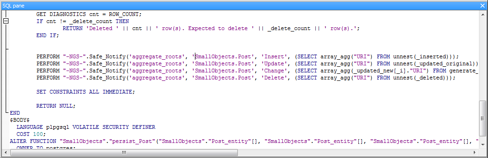

## Notifications, cache invalidation and server push

####How it works

Revenj leverages database notifications, such as [LISTEN/NOTIFY](http://www.postgresql.org/docs/9.1/static/sql-notify.html) in Postgres or [Advanced Queueing](http://docs.oracle.com/cd/B10501_01/appdev.920/a96587/qintro.htm) in Oracle, to provide notifications on data change in distributed environment. It also supports in process notifications without the database to provide always up-to-date data within the process which modified it.

####How to use it

This allows it to provide several complex features through some simple services such as [`IDataChangeNotification`](https://github.com/ngs-doo/revenj/blob/master/csharp/Core/Revenj.Core.Interface/DomainPatterns/Notification.cs) or through `IDataContext`. Change notification is a singleton which is getting invoked asynchronously from database on commit. Thus events will be raised with a small delay. An example of registering for changes on an aggregate root Post will look like:

    IDataContext ctx = ...
    var changes = ctx.Track<Post>();

On each Post insert/update or delete changes will be notified (if transaction successfully performs a commit; if rollback is performed, no event will be raised).

Alternative way to use it is to request `IObservable` signature for that object, such as `IObservable<Post>`. An example of such usage can be found in default security permission manager. Reasoning for using `IObservable` is that our code is sticking to only [BCL](http://en.wikipedia.org/wiki/Standard_Libraries_%28CLI%29) types (with a meaning). This is in line with the rest of DI supported vocabulary (such as `IEnumerable`, `Lazy`, `Func` and others) and removes dependencies in code from the used framework.

####Advanced configuration

In case of Postgres, DSL Platform will write notification code directly into DB function, which means even if you call it outside of Revenj notification it will still be invoked. 

Notification is enabled by default in DSL, but it can be turned off and manually applied to specific aggregates. A DSL which disables the global notification settings and includes it manually on specific aggregate will look like:

    defaults { notifications disabled; }
    module Todo {
      aggregate Task {
		string description;
        persistence { notifications enabled; }
	}

Alternatively global notifications can be left enabled, but specific aggregates can be excluded with `notifications disabled` DSL inside `persistence` part. 

####Server side pushes

Revenj includes simple [SignalR](http://signalr.net/) integration (both for [v1](https://github.com/ngs-doo/revenj/tree/master/csharp/Server/Revenj.SignalRWeb) and [v2](https://github.com/ngs-doo/revenj/tree/master/csharp/Server/Revenj.SignalR2SelfHost)). They are based on notification infrastructure and offer several ways for interfacing:

 * listen to all notifications for an aggregate/event - Listen
 * listen for notifications for a specific aggregate - WatchSingle
 * listen for notifications for collection of aggregates - WatchCollection
 * listen for notifications for all aggregates which satisfy provided specification - WatchSpecification

These APIs can be used from Javascript, Android or any other SignalR client to tap into real time changes from server. Example of Android integration using [singlar client sdk](https://github.com/SignalR/java-client) would look like

    Platform.loadPlatformComponent(new AndroidPlatformComponent());
    HubConnection connection = new HubConnection("http://signalr.dsl-platform.com:9013/");
    final HubProxy hub = connection.createHubProxy("NotifyHub");
    SignalRFuture<Void> init = connection.start();
    init.done(new Action<Void>() {
        @Override
        public void run(Void aVoid) throws Exception {
            SignalRFuture<Void> registration = hub.invoke("WatchSingle", "Todo.Task", uri); //listen to specific Todo.Task
            registration.done(new Action<Void>() {
                @Override
                public void run(Void aVoid) throws Exception {
                    hub.on("Changed", new SubscriptionHandler() {
                        @Override
                        public void run() {
                             //server side notification about Task.Todo change for provided uri
                        }
                    });
                }
            });
        }
    });

Most of the heavy work is done in SignalR, so its [tutorials](https://github.com/SignalR/SignalR/wiki/SignalR-JS-Client) should be inspected for more details on how to work with SignalR. 

####Processing streams on the server

[Reactive extensions](http://msdn.microsoft.com/en-us/data/gg577609.aspx) can be utilized to consume notifications in a really convenient way. An example of this can be found in [Revenj mailer](https://github.com/ngs-doo/revenj/blob/master/csharp/Features/Revenj.Features.Mailer/QueueProcessor.cs). Rx subscription is registered on `IMailMessage` interface with a buffer after which processing of all existing mails is executed. Relevant part of the code looks like:

    Subscription =
        ChangeNotification.Track<IMailMessage>()
            .Buffer(BufferTimeout, BufferCount)
            .Subscribe(_ => Task.Factory.StartNew(ProcessAll));
 
where *ChangeNotification* is `IDataChangeNotification`, *IMailMessage* is implemented by some aggregate, mails are buffered using a timeout and count after which a task is started to process all emails. Mail interface can be registered on some aggregate through specific DSL:

    aggregate MyEmails {
        implements 'Revenj.Features.Mailer.IMailMessage';
        //the rest of properties need to be specified
    }

DSL examples can be found in [mailer project](https://github.com/ngs-doo/revenj/tree/master/csharp/Features/Revenj.Features.Mailer/DSL). *Due to bugs in Mono binary serialization, special DSL exists for Mono which uses native model instead of native&lt;type&gt; concept. `Native<type>` is implemented as binary field in the database and binary serialization is used for conversion to and from the database.*

Notification is raised only for aggregates and events. Since entity and values must be a part of an aggregate/event to be persisted, hooks needs to be registered for containers (aggregate roots/events) of those objects. Fortunately hooks work on interfaces, so with the help of mixins and external interfaces succinct code can still be written. 