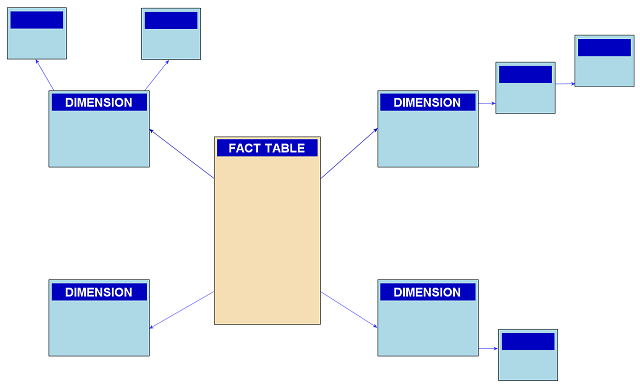
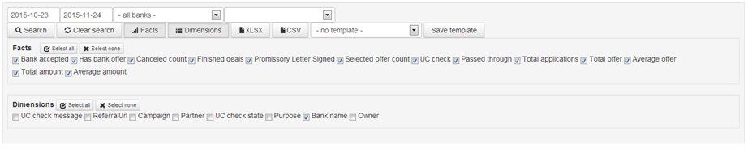

## OLAP cube queries in Revenj

#### Understanding what OLAP cube means in Revenj

On line transaction processing; or OLTP stands for system running a lot of small transactions.
Online analytical processing; or OLAP stands for system which runs analytical queries.
While complex/large systems benefit from having separate OLTP and OLAP systems, even OLTP systems run various kinds of OLAP queries.

An example of OLAP query is an aggregation, such as COUNT or SUM on a subset of data.
In terms of SQL this usually means GROUP BY dimensions and AGGREGATE BY facts, eg:

    SELECT product, COUNT(*) as sold_items, SUM(price) as total_sales
    FROM Sale
    GROUP BY product

where we want to find the number of items sold and total amount of money earned from sales for that product.

To be more precise [OLAP](https://en.wikipedia.org/wiki/OLAP_cube) stands for three basic analytical operations:

 * consolidation - aggregation of facts
 * drill down - grouping by dimensions
 * slicing and dicing - filtering on data subset

There are two major data sources used for such operations:

 * [star schema](https://en.wikipedia.org/wiki/Star_schema) - which allows only up to one level join
 * [snowflake schema](https://en.wikipedia.org/wiki/Snowflake_schema) - which allows for multi-level joins

While OLTP systems are usually normalized and use snowflake schema for rich querying, OLAP systems are often denormilized and most queries are star schema queries.

While DSL Platform has snowflake concept for defining projections of the data, Revenj supports any data source as input for OLAP cubes/queries.
Therefore specialized SQL can be created as data sources and Revenj will happily use them to run OLAP queries.

####OLAP cubes

Cubes defined in DSL can be used from Revenj as data sources for OLAP queries.
This is done through [OLAP cube query interface](https://github.com/ngs-doo/revenj/blob/master/java/revenj-core/src/main/java/org/revenj/patterns/OlapCubeQuery.java)

For a simple DSL such as:

    module Todo {
      aggregate Task(name) {
        string name;
		string project;
        date created;
        date? closed;
		calculated isOpen 'it => it.closed == null';
      }
      cube<Task> TaskAnalysis {
        dimension name;
		dimension project;
        count created total;
		sum closed;
		sum isOpen opened;
      }
    }

we've defined cube on top of single `Task` table. Now we can use `TaskAnalysis` to gain insights into our data.
For example, if we want to know per project how many tasks there are and how many are still opened, instead of manually running SQL query such as:

    SELECT project, COUNT(*) as total, SUM(CASE WHEN closed IS NULL THEN 1 ELSE 0 END) as opened
    FROM Task
    GROUP BY project

we can run Revenj OLAP query by specifying project as a dimension and total and opened as facts.
This will be translated into similar SQL query as above, but will not leave Java to run such a query.

If we are interested in only subset of data, eg. only in year 2006; which would translate into WHERE part of the SQL query, in Revenj this is done by providing a specification filter to the query, either through a predefined specification or a lambda expression.
Complete example in Revenj would look like:

    TaskAnalysis cube = new TaskAnalysis(locator);
    List<Map<String, Object>> results =
      cube.builder()
        .use(TaskAnalysis.project)
        .use(TaskAnalysis.total)
        .use(TaskAnalysis.opened)
        .analyze(it -> it.created.getYear() == 2016);

which would return the list of appropriate objects (project name, total tasks in project, opened task in project) which were created in year 2016).

####Generic OLAP API

Servlet API has a support for [OLAP conversion](https://github.com/ngs-doo/revenj/blob/master/java/revenj-servlet/src/main/java/org/revenj/server/servlet/StandardServlet.java).
This means that HTTP can be used to ask ad hoc queries such as

    GET /Commands.svc/olap/Todo.TaskAnalysis?dimensions=project&facts=total,opened

and run equivalent queries without even writing any Java code.
This allows easy to use client side interface such as:

which can give answer to wide range of questions.