## Revenj tutorial with .NET, Postgres and Visual studio

**Revenj** is a set of libraries for .NET and Mono with support for Postgres and Oracle databases. 
While it can be used as any other framework, it's rather small (feature wise) and it's best used as a backend for [DSL Platform](https://dsl-platform.com). 
This makes it ideal as a [REST service](http://c2.com/cgi/wiki?RestArchitecturalStyle) built on [DSL](http://c2.com/cgi/wiki?DomainSpecificLanguage) models, or within some other framework such as ASP.NET. 

- Revenj contains [LINQ](http://msdn.microsoft.com/en-us/library/bb397926.aspx) providers for Postgres and Oracle, somewhat different from other LINQ providers since it leverages object-oriented features of those databases. This allows for having a [NoSQL documents](http://en.wikipedia.org/wiki/Document-oriented_database) inside a relational databases.
- Revenj also supports various serializations out of the box, such as: Json, Protobuf and XML.
- Inversion of control is used to bind various services together and Autofac (slightly modified) is the default container.
- Advanced features such as [AOP](http://docs.castleproject.org/Windsor.Introduction-to-AOP-With-Castle.ashx) are supported, which means aspects can be registered to utilize various inspections and fixes, without providing alternative service implementations.
- Plugin based architecture allows for easy extensions without code changes or recompilations. Signature based extensions are utilized, so even convention or configuration are not necessary, since services are picked up by their signature, not their name or explicit wiring.

In this tutorial we will use it as a REST service to show off why Revenj/DSL Platform is useful. 
To get started, we'll need a Postgres (9.1 or newer) and .NET (4.0 or newer). 
DSL Platform is a DSL compiler which converts provided DSL model to target code/SQL.

### DSL introduction

Let's start with a minimal DSL and a simple [CRUD](http://en.wikipedia.org/wiki/Create,_read,_update_and_delete) operation to get a feeling what's happening.

Minimal useful DSL we can write is:

    module Tutorial {
      aggregate Example;
    }

but this contains syntax sugar, since that is almost equivalent to a slightly longer DSL:

    module Tutorial {
      aggregate Example(ID) {
        int ID { sequence; }
      }
    }

So we have a module named Tutorial which will be mapped to namespace *Tutorial* in C#, to schema Tutorial in Postgres and an [aggregate root](http://dddcommunity.org/resources/ddd_terms/) *Example* (think of it as a master entity). 
*ID* is provided by the database since we utilized sequence concept.

To CRUD it we can use [REST-like API](https://github.com/ngs-doo/revenj/blob/master/csharp/Plugins/Revenj.Plugins.Rest.Commands/ICrudCommands.cs) available in a plugin DLL provided with Revenj.

Rest plugin is using WCF signature for defining endpoint and is available (by default) via `/Crud.svc/Tutorial.Example` url.

### Configuring DSL Platform plugin

Let's start the server by running Revenj.Http.exe (since this is supported by Mono too).

To start the server, we'll need to provide DLL compiled locally with sources generated by DSL Platform. 
We'll also have to upgrade the database with SQL script.

For the rest of the tutorial we'll be assuming usage of [DDD for DSL](http://visualstudiogallery.msdn.microsoft.com/5b8a140c-5c84-40fc-a551-b255ba7676f4) Visual studio plugin. Alternatively, same actions can be done using command client.

In Visual studio create a new Class Library project for .NET 4 or newer:

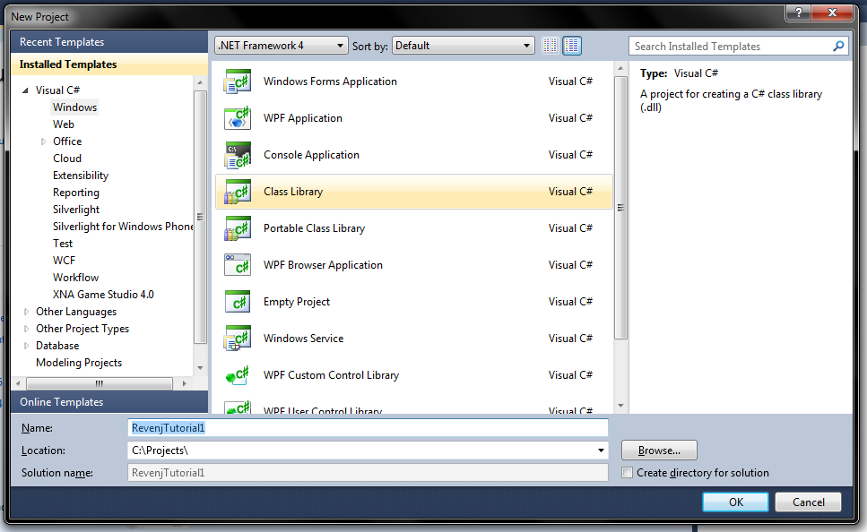

Now we can use right click on the solution to pull up the properties and select the *DSL Platform* option.

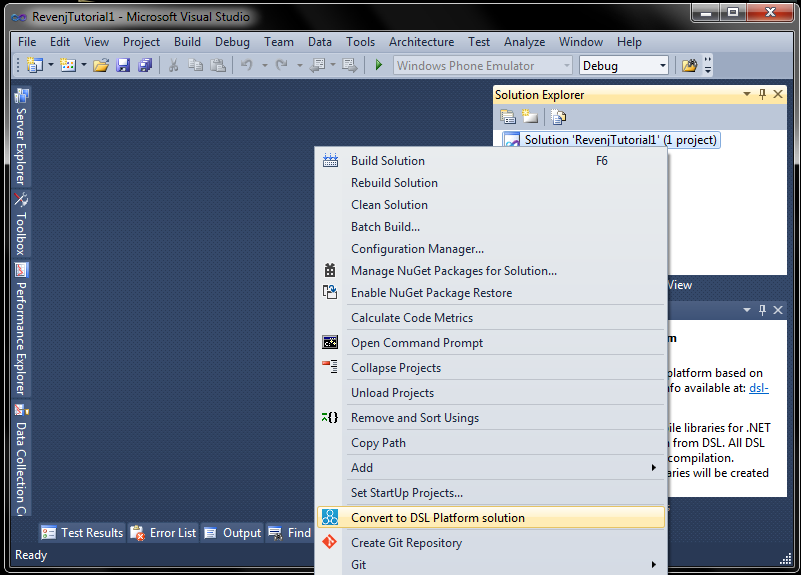

We could also manually edit the sln file to understand what's going on. 
We need to insert a block to sln to enable unmanaged project compilation after which sln file should look something like:

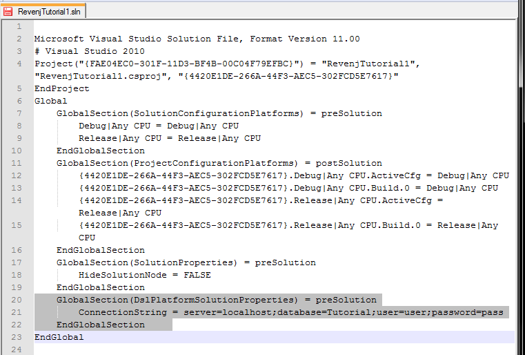

Basically, we need to define a `DslPlatformSolutionProperties` section with a `ConnectionString` key. 
Afer that we can either log in to DSL Platform or use an offline mode (where a local compiler is used):

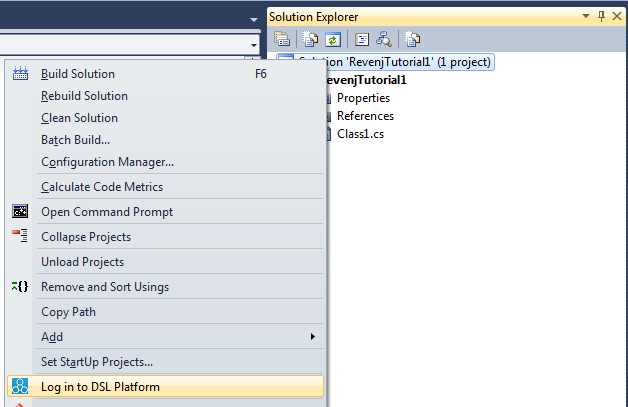

Once logged in we will get a window where we can invoke DSL compilation, but first, let's download and configure dependencies. 
In configuration window, we can download the Full Revenj version for server library (alternatively we can download it from [Github](https://github.com/ngs-doo/revenj/releases/latest) or Nuget).

Let's also enable Apply migration option so that we don't need to manually run SQL script against the database. 
If we are interested in SQL scripts, we can specify SQL folder, so let's create a sql folder inside our project and type in sql in *SQL scripts path*.

To finish preparation, we need to create a lib folder or point configuration to an alternative folder where our compiler library will be located.
So let's start by adding a new text file named tutorial.ddd (or tutorial.dsl) and paste in the DSL. 
We should have something like this:

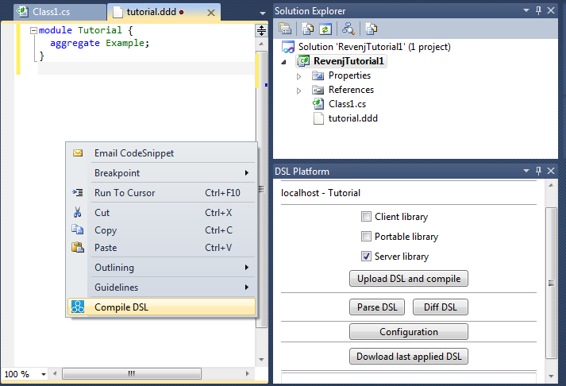

We can invoke compilation with a *Upload DSL and compile* button or with a right click on the DSL window and using Compile DSL menu. 
After saving ddd file and starting the compilation, since *Diff before compile* option is enabled we will see a screen:

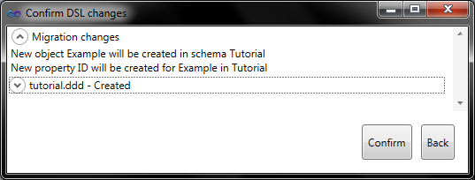

explaining what will happen in SQL. 
After confirmation database should be upgraded which we can check in PgAdmin:

DB script which was used to migrate the database can be found in the folder specified in configuration. 
It should look something like this:

At the beginning it will contain comments of database changes, following by a check if database upgrade is allowed. 
After that migration script will perform migration from the previous state to the current state. 
Since this was our initial migration, a helper -NGS- schema will be created, which is used for storing the previous version of applied DSL and some system functions.

### Starting the http server

To start the Revenj Http server let's add start external program to out project and point it to the Revenj.Http.exe downloaded to dependencies/Server folder:

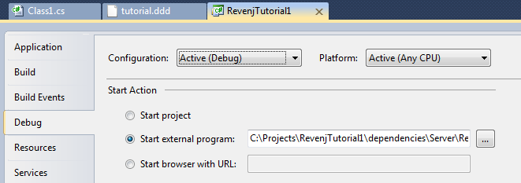

The last thing we need to do is to change the config file; point it to our lib folder and adjust the connection string:

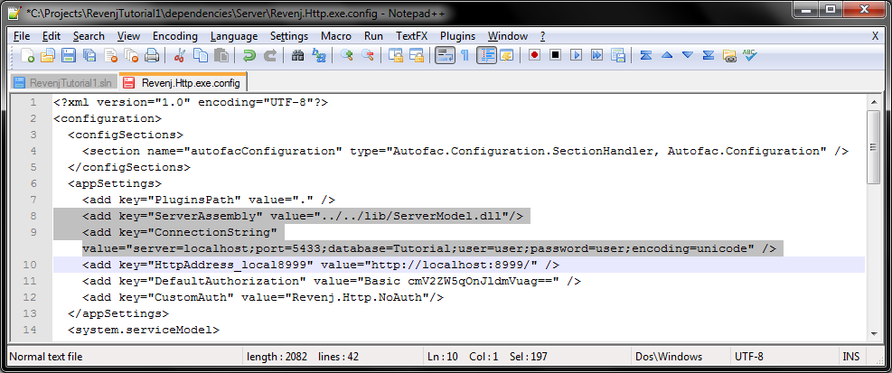

*While this is not ideal, since new download can override our configuration, let's use it for now as is*.
Now we can run our project which will start Revenj server using our customized library. 
Let's try if it works with [Fiddler](http://www.telerik.com/download/fiddler). 
By default, config has disabled authorization using NoAuth class specified as custom authorization and override for security permissions. 
So we can just point POST to url specified in the config:

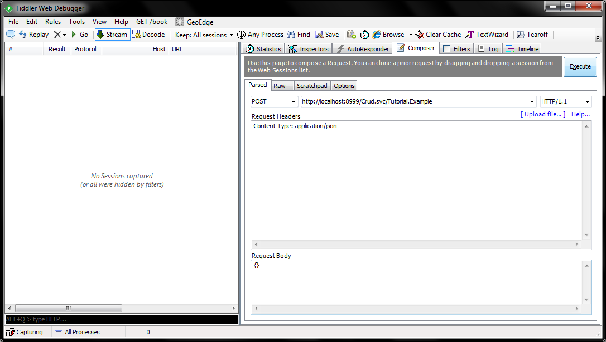

If everything is working, we should get a response from the server:

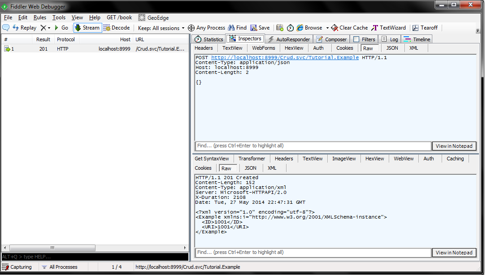

Since we didn't specify Accept header, server answered in the default format (in this case with XML).

### First tour through Revenj

**So how was this processed by Revenj?**

POST request came to the `Crud.svc/Tutorial.Example` url. 
This is handled by the `ICrudCommands.cs` service contract in REST commands plugin:

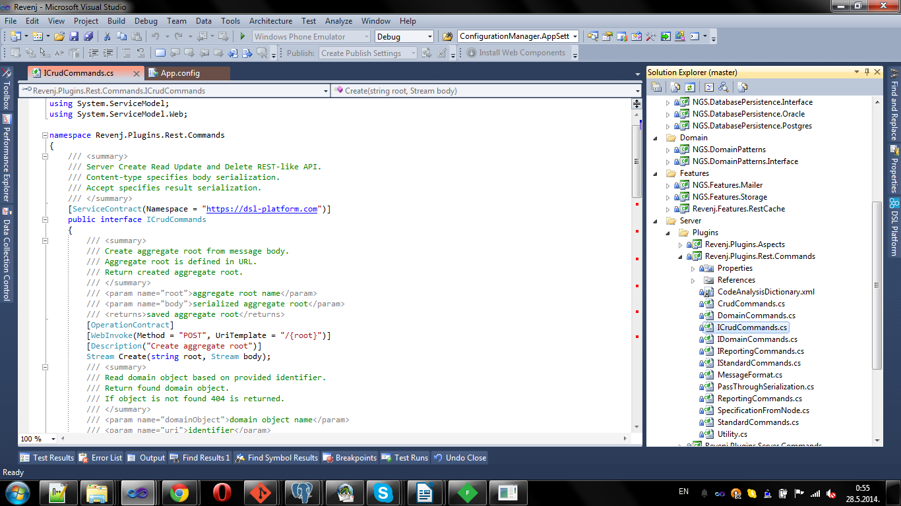

During initialization, Revenj Http looked up all WCF service contracts and initialized them. Revenj Http is actually using .NET HttpListener, but it's passing its requests to matched WCF service contracts, in this case `Crud.svc` Create method.

Its implementation `CrudCommands.cs` is just passing it through the Revenj pipeline to the underlying Create class in `Revenj.Plugins.Server.Commands` project, which:

 - performs basic validations
 - checks caller permissions
 - deserializes object (or casts is from previously deserialized one) to correct type
 - calls insert on repository with it 
 - and returns it to the caller in requested format

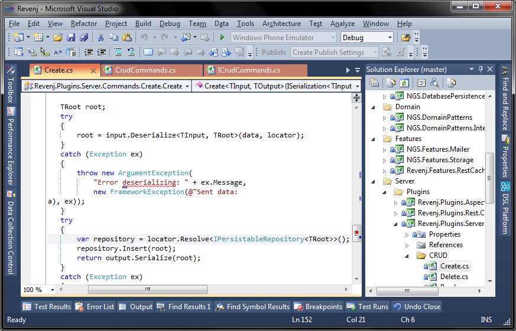

This is the basic architecture of processing requests in Revenj. 
While few interesting things happened in the pipeline, we will not discuss them in this tutorial.

### Modeling NoSQL documents

Now that we have a working setup and understand the basic processing of the request, let's write more interesting model, not just standard [ER](http://en.wikipedia.org/wiki/Entity%E2%80%93relationship_model) one.

Let's write our final model for this tutorial:

    module Tutorial {
      aggregate Example {
        timestamp StartedOn;
        string CodeName;
        Set<string(10)> Tags;
        List<Idea> Ideas;
        persistence { history; }
      }
      value Idea {
        date? ETA;
        Importance Rating;
        decimal Probability;
        string[] Notes;
      }
      enum Importance {
        NotUseful;
        GroundBreaking;
        WorldChanging;
      }
      snowflake<Example> ExampleList {
        StartedOn;
        CodeName;
        order by StartedOn desc;
      }
    }

to show off various minor and major features which are available with few simple descriptions.

DSL supports various property types, collections, references and basically everything you need to describe a complex domain, while DSL Platform will provide best-practice implementations for such concepts. 
DSL described above will result in a model which the developer would usually write in code and a lot of boilerplate hidden away which will be used, such as repositories, conversions from C# objects to Postgres objects, various validations, boilerplate code for serialization and various other libraries, useful methods such as Clone, Equals and many others.

If we add a reference to our lib and take a look how that looks from Visual studio we will see something like:

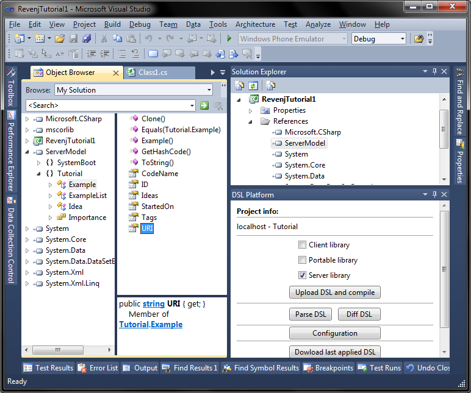

Repositories and various other services have internal modifier, but are available through Revenj interfaces. 
So *ExampleList* repository can be resolved as `IQueryableRepository<ExampleList>` or by using `IDataContext` with its `Query<ExampleList>()` method. 
If for some reason custom repository needs to be used, a registration to the container with the new repository will override the default registration.

It's interesting to take a look at the database to see the model. 
Advanced object-oriented features of Postgres are utilized for some aspects of the model, such as `Set`, `List` and `value object`:

If you look at the database you will find collection of `varchar(10)` named *Tags*, collection of types named *Ideas*, history table matching exact structure, `persist_Example` function which accepts arrays as arguments and is optimized for bulk processing. 
If necessary, optimized single insert/update function can be created in the database and called from repository. 
Data access doesn't actually go through the tables, but through the views, so, if required, [DBA](http://en.wikipedia.org/wiki/Database_administrator) can alter objects created by the Platform and report an issue which will then result in a better database object or an additional modeling concept. 
Of course, dropping down to SQL when everything else fails can be done through the DSL.

### Conclusion

So while some [ORMs](http://en.wikipedia.org/wiki/Object-relational_mapping) can support simple NoSQL models, neither is close to supporting advanced NoSQL-like modeling in the database DSL Platform provides and Revenj utilizes. 
Of course, nobody is forcing developer to use object oriented features, collections and various other non-relational constructs, but since those can provide various optimizations they are often useful.

Basic premise behind DSL is to have a ubiquitous language not only in the core domain, but everywhere. 
This greatly improves communication between various developers. 
If they utilize correct domain terminology, this brings application a lot closer to the domain-expert which can now validate model by reading DSL - a formal documentation.

Let's look at few examples of the boilerplate validations which were created. 
Aggregate root has a `Set<string(10)>` field. 
Since neither the field, nor the content of the field is optional, generated code will check for nulls. 
Also, since we are using a `string(10)` type, it will guard against tags longer than 10 chars. 
All those checks improve the quality of our data, but are often cumbersome to write.

**But what about some advanced features available as a single DSL line, such as history concept?**

This concept is translated to various objects in the database, snippets of code during persist, casts between representations, specialized services in the code, basically various boilerplate one would need to write/specify to get such a complex feature. 
And it's complex since history objects is also typesafe in the database. 
If we just stored the object as JSON or something similar in a field, it would introduce problems down the line when we tried to change the model. 
Goal of the DSL Platform is to help you write code which will not turn into legacy. 
To be able to do that, DSL Platform maintains typesafe models everywhere. 
If domain is explored during lifetime of the application, deeper insights should happen. 
They result in fields being moved around, renames, nullability changes and various other small and big changes. 
To keep up with that, [automatic migrations](https://docs.dsl-platform.com/dsl-migrations) keep model in sync with the database and typesafe compilers warn about hand written code on top of recreated DSL model.

Regarding the history feature, from the developer point of view, he will just use a `IRepository<IHistory<Example>>`, while the compilers will take care of all the boring work.
